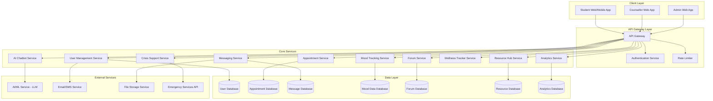
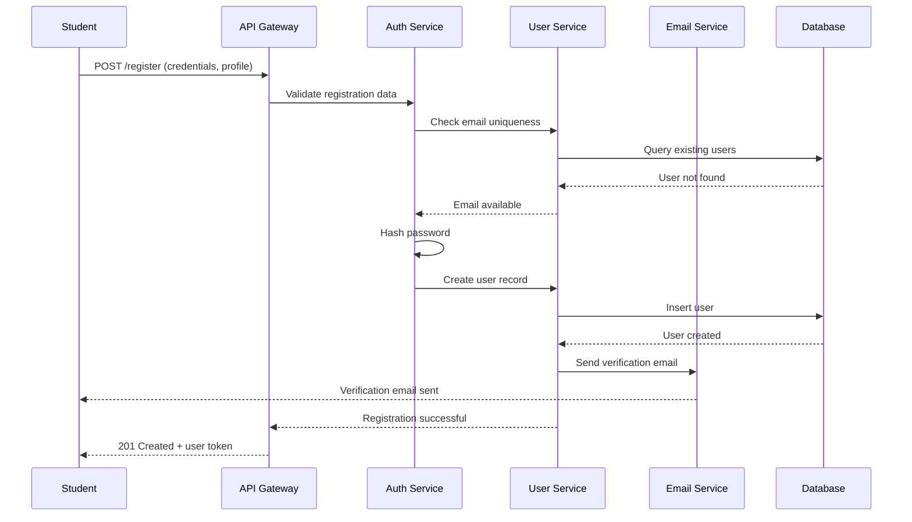
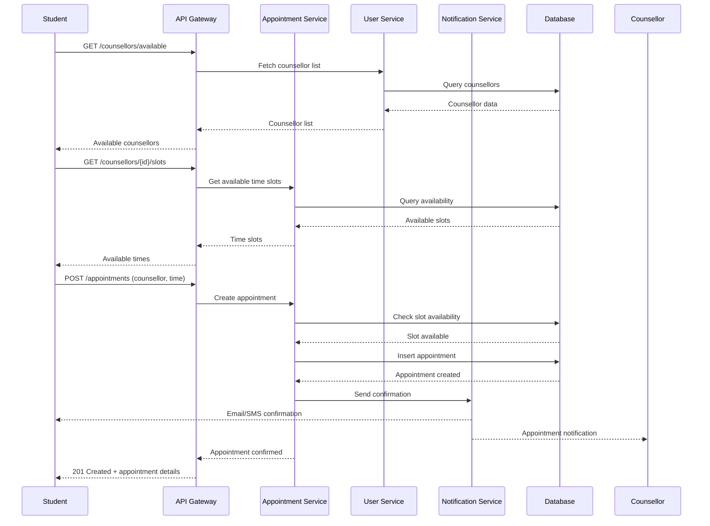
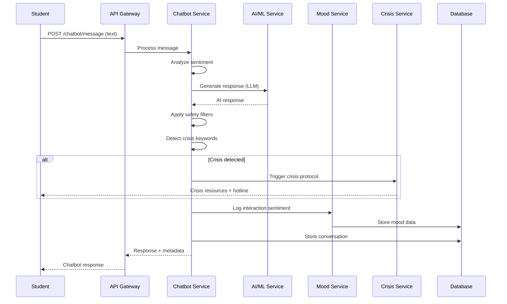
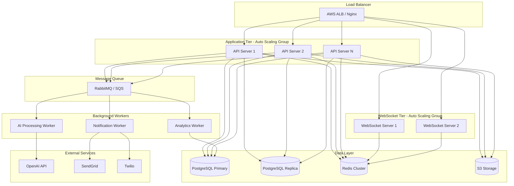

# Design Document: Mindful Wellness Platform

## Overview

The Mindful Wellness Platform is a comprehensive student mental health and wellness system designed to provide multi-faceted support through technology-enabled interventions. The platform serves three distinct user roles: students seeking mental health support, counsellors providing professional guidance, and administrators managing the institutional wellness infrastructure.

The system integrates AI-powered chatbot support, mood tracking and journaling, appointment scheduling, secure messaging, peer support forums, crisis intervention, and gamified wellness tracking. The architecture emphasizes data privacy, scalability, real-time communication, and evidence-based mental health interventions. The platform supports multi-language accessibility and provides comprehensive analytics for institutional decision-making while maintaining student anonymity where appropriate.

The design follows a microservices architecture with clear separation of concerns, enabling independent scaling of high-traffic components (AI chatbot, real-time chat) while maintaining data consistency across services. Security is paramount, with end-to-end encryption for sensitive communications, role-based access control, and compliance with healthcare data protection standards.

## Architecture

The platform follows a microservices architecture with the following high-level structure:



### System Architecture Layers

1. **Client Layer**: Role-specific web and mobile applications with responsive UI
2. **API Gateway Layer**: Centralized entry point with authentication, authorization, and rate limiting
3. **Core Services Layer**: Independent microservices handling specific business domains
4. **Data Layer**: Distributed databases with service-specific data stores
5. **External Services Layer**: Third-party integrations for AI, notifications, and emergency services


## Main Workflows

### Student Registration and Authentication Flow



### Appointment Booking Flow



### AI Chatbot Interaction Flow




## Components and Interfaces

### Component 1: Authentication Service

**Purpose**: Manages user authentication, authorization, session management, and password recovery for all user roles (students, counsellors, admins).

**Interface**:
```pascal
INTERFACE AuthenticationService
  PROCEDURE register(userData: UserRegistrationData): AuthResult
  PROCEDURE login(credentials: LoginCredentials): AuthResult
  PROCEDURE logout(sessionToken: Token): Boolean
  PROCEDURE verifyToken(token: Token): TokenValidationResult
  PROCEDURE refreshToken(refreshToken: Token): AuthResult
  PROCEDURE initiatePasswordReset(email: String): Boolean
  PROCEDURE resetPassword(resetToken: Token, newPassword: String): Boolean
  PROCEDURE changePassword(userId: UUID, oldPassword: String, newPassword: String): Boolean
END INTERFACE
```

**Responsibilities**:
- Validate user credentials and issue JWT tokens
- Manage session lifecycle and token refresh
- Implement role-based access control (RBAC)
- Handle password hashing using bcrypt/argon2
- Manage password reset workflows with time-limited tokens
- Enforce password complexity policies
- Implement rate limiting for authentication attempts
- Log authentication events for security auditing

### Component 2: User Management Service

**Purpose**: Manages user profiles, preferences, and role-specific data for students, counsellors, and administrators.

**Interface**:
```pascal
INTERFACE UserManagementService
  PROCEDURE createUser(userData: UserData, role: UserRole): User
  PROCEDURE getUserById(userId: UUID): User
  PROCEDURE getUserByEmail(email: String): User
  PROCEDURE updateUserProfile(userId: UUID, updates: ProfileUpdates): User
  PROCEDURE deleteUser(userId: UUID): Boolean
  PROCEDURE getCounsellors(filters: CounsellorFilters): List<Counsellor>
  PROCEDURE getCounsellorById(counsellorId: UUID): Counsellor
  PROCEDURE updateCounsellorAvailability(counsellorId: UUID, availability: AvailabilitySchedule): Boolean
  PROCEDURE getStudentProfile(studentId: UUID): StudentProfile
  PROCEDURE updateLanguagePreference(userId: UUID, language: String): Boolean
END INTERFACE
```

**Responsibilities**:
- CRUD operations for user accounts
- Manage user profiles with role-specific attributes
- Store and retrieve counsellor specializations and availability
- Handle student wellness preferences and settings
- Manage admin permissions and access levels
- Implement soft delete for data retention compliance
- Validate profile data integrity

### Component 3: Appointment Service

**Purpose**: Manages the complete appointment lifecycle including scheduling, rescheduling, cancellation, and availability management.

**Interface**:
```pascal
INTERFACE AppointmentService
  PROCEDURE getAvailableSlots(counsellorId: UUID, dateRange: DateRange): List<TimeSlot>
  PROCEDURE bookAppointment(studentId: UUID, counsellorId: UUID, slot: TimeSlot, reason: String): Appointment
  PROCEDURE cancelAppointment(appointmentId: UUID, cancelledBy: UUID, reason: String): Boolean
  PROCEDURE rescheduleAppointment(appointmentId: UUID, newSlot: TimeSlot): Appointment
  PROCEDURE getAppointmentById(appointmentId: UUID): Appointment
  PROCEDURE getStudentAppointments(studentId: UUID, status: AppointmentStatus): List<Appointment>
  PROCEDURE getCounsellorAppointments(counsellorId: UUID, dateRange: DateRange): List<Appointment>
  PROCEDURE markAppointmentComplete(appointmentId: UUID, notes: String): Boolean
  PROCEDURE getUpcomingAppointments(userId: UUID): List<Appointment>
END INTERFACE
```

**Responsibilities**:
- Manage counsellor availability calendars
- Handle appointment booking with conflict detection
- Implement cancellation policies and notifications
- Track appointment status (scheduled, completed, cancelled, no-show)
- Generate appointment reminders
- Maintain appointment history
- Handle timezone conversions for scheduling

### Component 4: Messaging Service

**Purpose**: Provides secure, real-time messaging between students and counsellors with end-to-end encryption.

**Interface**:
```pascal
INTERFACE MessagingService
  PROCEDURE sendMessage(senderId: UUID, receiverId: UUID, content: EncryptedMessage): Message
  PROCEDURE getConversation(userId1: UUID, userId2: UUID, pagination: PaginationParams): List<Message>
  PROCEDURE getConversations(userId: UUID): List<Conversation>
  PROCEDURE markMessageAsRead(messageId: UUID, userId: UUID): Boolean
  PROCEDURE deleteMessage(messageId: UUID, userId: UUID): Boolean
  PROCEDURE uploadAttachment(senderId: UUID, file: File): Attachment
  PROCEDURE getUnreadCount(userId: UUID): Integer
  PROCEDURE blockUser(userId: UUID, blockedUserId: UUID): Boolean
END INTERFACE
```

**Responsibilities**:
- Implement WebSocket connections for real-time messaging
- Encrypt messages end-to-end using public key cryptography
- Store encrypted messages with metadata
- Handle file attachments with virus scanning
- Implement message delivery and read receipts
- Manage conversation threads
- Enforce messaging permissions (students can only message assigned counsellors)
- Implement message retention policies


### Component 5: Mood Tracking Service

**Purpose**: Manages daily mood check-ins, mood journaling, sentiment analysis, and mood history visualization.

**Interface**:
```pascal
INTERFACE MoodTrackingService
  PROCEDURE recordMoodEntry(studentId: UUID, moodData: MoodEntry): MoodRecord
  PROCEDURE getMoodHistory(studentId: UUID, dateRange: DateRange): List<MoodRecord>
  PROCEDURE getMoodTrends(studentId: UUID, period: TimePeriod): MoodTrendAnalysis
  PROCEDURE getDailyCheckInStatus(studentId: UUID, date: Date): Boolean
  PROCEDURE analyzeSentiment(journalText: String): SentimentScore
  PROCEDURE getMoodInsights(studentId: UUID): MoodInsights
  PROCEDURE getCounsellorViewMoodHistory(counsellorId: UUID, studentId: UUID): List<MoodRecord>
  PROCEDURE exportMoodData(studentId: UUID, format: ExportFormat): File
END INTERFACE
```

**Responsibilities**:
- Store daily mood ratings and journal entries
- Perform sentiment analysis on journal text
- Generate mood trend visualizations
- Detect concerning mood patterns
- Provide mood insights and recommendations
- Allow counsellors to view student mood history (with permission)
- Implement privacy controls for mood data
- Generate mood reports for wellness roadmap

### Component 6: AI Chatbot Service

**Purpose**: Provides AI-powered conversational support using large language models with mental health safety guardrails.

**Interface**:
```pascal
INTERFACE AIChatbotService
  PROCEDURE sendMessage(studentId: UUID, message: String, context: ConversationContext): ChatbotResponse
  PROCEDURE getConversationHistory(studentId: UUID, limit: Integer): List<ChatMessage>
  PROCEDURE analyzeCrisisRisk(message: String): CrisisRiskScore
  PROCEDURE generateResponse(message: String, context: ConversationContext): String
  PROCEDURE applySafetyFilters(response: String): FilteredResponse
  PROCEDURE logInteraction(studentId: UUID, interaction: ChatInteraction): Boolean
  PROCEDURE getChatbotAnalytics(dateRange: DateRange): ChatbotMetrics
END INTERFACE
```

**Responsibilities**:
- Integrate with LLM API (OpenAI, Anthropic, or custom model)
- Maintain conversation context and history
- Implement mental health-specific prompt engineering
- Detect crisis keywords and escalate appropriately
- Apply content safety filters to responses
- Provide empathetic, non-judgmental responses
- Log interactions for quality improvement
- Implement rate limiting to prevent abuse
- Ensure HIPAA/GDPR compliance for conversation data

### Component 7: Forum Service

**Purpose**: Manages peer support forums with moderation, threading, and community guidelines enforcement.

**Interface**:
```pascal
INTERFACE ForumService
  PROCEDURE createPost(authorId: UUID, content: PostContent, category: String): Post
  PROCEDURE getPost(postId: UUID): Post
  PROCEDURE getPosts(category: String, pagination: PaginationParams): List<Post>
  PROCEDURE updatePost(postId: UUID, authorId: UUID, content: PostContent): Post
  PROCEDURE deletePost(postId: UUID, userId: UUID): Boolean
  PROCEDURE createComment(postId: UUID, authorId: UUID, content: String): Comment
  PROCEDURE getComments(postId: UUID): List<Comment>
  PROCEDURE votePost(postId: UUID, userId: UUID, voteType: VoteType): Boolean
  PROCEDURE reportPost(postId: UUID, reporterId: UUID, reason: String): Report
  PROCEDURE moderatePost(postId: UUID, moderatorId: UUID, action: ModerationAction): Boolean
  PROCEDURE searchPosts(query: String, filters: SearchFilters): List<Post>
END INTERFACE
```

**Responsibilities**:
- Create and manage forum posts and comments
- Implement threaded discussions
- Support anonymous posting with moderation
- Implement voting and reputation systems
- Content moderation with AI-assisted flagging
- Enforce community guidelines
- Search and filter posts by category/tags
- Notify users of replies and mentions

### Component 8: Resource Hub Service

**Purpose**: Manages mental health resources, articles, videos, and institutional resources with categorization and search.

**Interface**:
```pascal
INTERFACE ResourceHubService
  PROCEDURE getResources(category: String, pagination: PaginationParams): List<Resource>
  PROCEDURE getResourceById(resourceId: UUID): Resource
  PROCEDURE searchResources(query: String, filters: ResourceFilters): List<Resource>
  PROCEDURE createResource(adminId: UUID, resourceData: ResourceData): Resource
  PROCEDURE updateResource(resourceId: UUID, updates: ResourceUpdates): Resource
  PROCEDURE deleteResource(resourceId: UUID): Boolean
  PROCEDURE trackResourceView(resourceId: UUID, userId: UUID): Boolean
  PROCEDURE getPopularResources(limit: Integer): List<Resource>
  PROCEDURE getRecommendedResources(studentId: UUID): List<Resource>
  PROCEDURE manageOfflineResources(institutionId: UUID, resources: List<OfflineResource>): Boolean
END INTERFACE
```

**Responsibilities**:
- Store and categorize mental health resources
- Support multiple resource types (articles, videos, PDFs, links)
- Implement full-text search
- Track resource views and engagement
- Provide personalized resource recommendations
- Manage institution-specific resources
- Handle offline resource information
- Support multi-language resources


### Component 9: Wellness Tracker Service

**Purpose**: Implements gamified wellness tracking with goals, achievements, streaks, and personalized wellness roadmaps.

**Interface**:
```pascal
INTERFACE WellnessTrackerService
  PROCEDURE createWellnessGoal(studentId: UUID, goalData: GoalData): WellnessGoal
  PROCEDURE getWellnessGoals(studentId: UUID): List<WellnessGoal>
  PROCEDURE updateGoalProgress(goalId: UUID, progress: ProgressUpdate): WellnessGoal
  PROCEDURE completeGoal(goalId: UUID): Achievement
  PROCEDURE getAchievements(studentId: UUID): List<Achievement>
  PROCEDURE getWellnessScore(studentId: UUID): WellnessScore
  PROCEDURE getStreak(studentId: UUID, activityType: String): StreakData
  PROCEDURE generateWellnessRoadmap(studentId: UUID): WellnessRoadmap
  PROCEDURE updateRoadmap(studentId: UUID, milestones: List<Milestone>): WellnessRoadmap
  PROCEDURE getLeaderboard(scope: LeaderboardScope): List<LeaderboardEntry>
END INTERFACE
```

**Responsibilities**:
- Track wellness activities and goals
- Calculate wellness scores based on multiple factors
- Implement achievement and badge systems
- Maintain activity streaks
- Generate personalized wellness roadmaps
- Provide gamification elements (points, levels, rewards)
- Create leaderboards with privacy controls
- Send motivational notifications

### Component 10: Crisis Support Service

**Purpose**: Provides immediate crisis intervention resources, emergency contact management, and crisis escalation protocols.

**Interface**:
```pascal
INTERFACE CrisisSupportService
  PROCEDURE triggerCrisisProtocol(studentId: UUID, severity: CrisisSeverity, context: String): CrisisResponse
  PROCEDURE getEmergencyContacts(location: String): List<EmergencyContact>
  PROCEDURE logCrisisEvent(studentId: UUID, eventData: CrisisEventData): Boolean
  PROCEDURE notifyAuthorities(studentId: UUID, crisisType: CrisisType): Boolean
  PROCEDURE getCrisisResources(crisisType: CrisisType): List<CrisisResource>
  PROCEDURE connectToHotline(studentId: UUID, hotlineType: String): HotlineConnection
  PROCEDURE getCrisisHistory(studentId: UUID, counsellorId: UUID): List<CrisisEvent>
  PROCEDURE updateCrisisStatus(crisisId: UUID, status: CrisisStatus, notes: String): Boolean
END INTERFACE
```

**Responsibilities**:
- Detect crisis situations from chatbot and mood data
- Provide immediate crisis resources and hotlines
- Implement escalation protocols
- Connect to emergency services when necessary
- Log crisis events for follow-up
- Notify designated contacts (with consent)
- Provide 24/7 crisis resource access
- Integrate with national crisis hotlines

### Component 11: Analytics Service

**Purpose**: Generates institutional analytics, reports, and insights while maintaining student anonymity.

**Interface**:
```pascal
INTERFACE AnalyticsService
  PROCEDURE generateDashboardMetrics(adminId: UUID, dateRange: DateRange): DashboardMetrics
  PROCEDURE getStudentEngagementMetrics(institutionId: UUID): EngagementMetrics
  PROCEDURE getCounsellorPerformanceMetrics(counsellorId: UUID): PerformanceMetrics
  PROCEDURE getAnonymousReports(institutionId: UUID, reportType: String): Report
  PROCEDURE getMoodTrendAnalytics(institutionId: UUID): MoodTrendReport
  PROCEDURE getResourceUsageAnalytics(dateRange: DateRange): ResourceUsageReport
  PROCEDURE getCrisisAnalytics(institutionId: UUID): CrisisAnalyticsReport
  PROCEDURE exportReport(reportId: UUID, format: ExportFormat): File
  PROCEDURE getFeedbackAnalytics(institutionId: UUID): FeedbackReport
END INTERFACE
```

**Responsibilities**:
- Aggregate anonymized student data
- Generate institutional wellness reports
- Track platform usage metrics
- Analyze counsellor workload and availability
- Identify trends in student mental health
- Generate compliance reports
- Provide data visualization
- Ensure data anonymization and privacy

### Component 12: Notification Service

**Purpose**: Manages multi-channel notifications (email, SMS, push, in-app) for appointments, messages, and alerts.

**Interface**:
```pascal
INTERFACE NotificationService
  PROCEDURE sendNotification(userId: UUID, notification: NotificationData): Boolean
  PROCEDURE sendEmail(recipient: String, subject: String, body: String, template: String): Boolean
  PROCEDURE sendSMS(phoneNumber: String, message: String): Boolean
  PROCEDURE sendPushNotification(userId: UUID, title: String, body: String): Boolean
  PROCEDURE getNotifications(userId: UUID, status: NotificationStatus): List<Notification>
  PROCEDURE markNotificationAsRead(notificationId: UUID): Boolean
  PROCEDURE updateNotificationPreferences(userId: UUID, preferences: NotificationPreferences): Boolean
  PROCEDURE scheduleNotification(notification: NotificationData, scheduledTime: DateTime): Boolean
END INTERFACE
```

**Responsibilities**:
- Send appointment reminders
- Notify users of new messages
- Send crisis alerts
- Deliver wellness milestone notifications
- Manage notification preferences
- Implement notification batching
- Handle notification delivery failures
- Support multiple notification channels


## Data Models

### Model 1: User

```pascal
STRUCTURE User
  id: UUID
  email: String
  passwordHash: String
  role: UserRole  // STUDENT, COUNSELLOR, ADMIN
  firstName: String
  lastName: String
  phoneNumber: String
  languagePreference: String
  profilePictureUrl: String
  isActive: Boolean
  isEmailVerified: Boolean
  createdAt: DateTime
  updatedAt: DateTime
  lastLoginAt: DateTime
END STRUCTURE

ENUMERATION UserRole
  STUDENT
  COUNSELLOR
  ADMIN
END ENUMERATION
```

**Validation Rules**:
- Email must be unique and valid format
- Password must meet complexity requirements (min 8 chars, uppercase, lowercase, number, special char)
- Phone number must be valid format
- Language preference must be from supported languages list
- Role must be one of the defined enum values

### Model 2: StudentProfile

```pascal
STRUCTURE StudentProfile
  userId: UUID  // Foreign key to User
  studentId: String  // Institution student ID
  institutionId: UUID
  dateOfBirth: Date
  gender: String
  emergencyContactName: String
  emergencyContactPhone: String
  consentForDataSharing: Boolean
  consentForAnonymousAnalytics: Boolean
  wellnessGoals: List<String>
  preferredCounsellorGender: String
  notificationPreferences: NotificationPreferences
  privacySettings: PrivacySettings
END STRUCTURE

STRUCTURE NotificationPreferences
  emailEnabled: Boolean
  smsEnabled: Boolean
  pushEnabled: Boolean
  appointmentReminders: Boolean
  messageNotifications: Boolean
  wellnessReminders: Boolean
  forumReplies: Boolean
END STRUCTURE

STRUCTURE PrivacySettings
  profileVisibility: String  // PUBLIC, FRIENDS, PRIVATE
  showMoodToForum: Boolean
  allowCounsellorMoodAccess: Boolean
  anonymousForumPosting: Boolean
END STRUCTURE
```

**Validation Rules**:
- Student ID must be unique within institution
- Date of birth must indicate age >= 13
- Emergency contact phone must be valid
- Consent fields must be explicitly set (not null)
- Privacy settings must have valid enum values

### Model 3: CounsellorProfile

```pascal
STRUCTURE CounsellorProfile
  userId: UUID  // Foreign key to User
  counsellorId: String
  institutionId: UUID
  licenseNumber: String
  specializations: List<String>
  qualifications: List<String>
  yearsOfExperience: Integer
  bio: String
  availabilitySchedule: AvailabilitySchedule
  maxAppointmentsPerDay: Integer
  appointmentDuration: Integer  // in minutes
  rating: Float
  totalAppointments: Integer
  isAcceptingNewStudents: Boolean
END STRUCTURE

STRUCTURE AvailabilitySchedule
  monday: List<TimeSlot>
  tuesday: List<TimeSlot>
  wednesday: List<TimeSlot>
  thursday: List<TimeSlot>
  friday: List<TimeSlot>
  saturday: List<TimeSlot>
  sunday: List<TimeSlot>
  exceptions: List<DateException>  // Holidays, time off
END STRUCTURE

STRUCTURE TimeSlot
  startTime: Time
  endTime: Time
END STRUCTURE

STRUCTURE DateException
  date: Date
  isAvailable: Boolean
  customSlots: List<TimeSlot>
END STRUCTURE
```

**Validation Rules**:
- License number must be valid and verified
- Specializations must be from predefined list
- Years of experience must be non-negative
- Appointment duration must be between 15 and 120 minutes
- Max appointments per day must be between 1 and 20
- Time slots must not overlap
- Start time must be before end time

### Model 4: Appointment

```pascal
STRUCTURE Appointment
  id: UUID
  studentId: UUID
  counsellorId: UUID
  scheduledStartTime: DateTime
  scheduledEndTime: DateTime
  status: AppointmentStatus
  appointmentType: String  // IN_PERSON, VIDEO, PHONE
  reason: String
  studentNotes: String
  counsellorNotes: String
  cancelledBy: UUID
  cancellationReason: String
  createdAt: DateTime
  updatedAt: DateTime
  completedAt: DateTime
END STRUCTURE

ENUMERATION AppointmentStatus
  SCHEDULED
  CONFIRMED
  IN_PROGRESS
  COMPLETED
  CANCELLED
  NO_SHOW
  RESCHEDULED
END ENUMERATION
```

**Validation Rules**:
- Student and counsellor must exist
- Scheduled start time must be in the future (for new appointments)
- End time must be after start time
- Status transitions must follow valid state machine
- Cancellation reason required if status is CANCELLED
- Counsellor notes only editable by counsellor


### Model 5: Message

```pascal
STRUCTURE Message
  id: UUID
  conversationId: UUID
  senderId: UUID
  receiverId: UUID
  encryptedContent: String  // Encrypted message body
  encryptionKey: String  // Encrypted with receiver's public key
  messageType: MessageType
  attachments: List<Attachment>
  sentAt: DateTime
  deliveredAt: DateTime
  readAt: DateTime
  isDeleted: Boolean
  deletedBy: UUID
END STRUCTURE

ENUMERATION MessageType
  TEXT
  IMAGE
  FILE
  VOICE
END ENUMERATION

STRUCTURE Attachment
  id: UUID
  fileName: String
  fileSize: Integer
  fileType: String
  storageUrl: String
  encryptedUrl: String
  uploadedAt: DateTime
END STRUCTURE

STRUCTURE Conversation
  id: UUID
  participant1Id: UUID
  participant2Id: UUID
  lastMessageAt: DateTime
  lastMessagePreview: String
  unreadCount1: Integer  // Unread count for participant1
  unreadCount2: Integer  // Unread count for participant2
  createdAt: DateTime
END STRUCTURE
```

**Validation Rules**:
- Sender and receiver must exist and have appropriate roles
- Students can only message counsellors (not other students)
- Encrypted content must not be empty
- File attachments must pass virus scanning
- File size must not exceed 10MB per attachment
- Message type must match content

### Model 6: MoodEntry

```pascal
STRUCTURE MoodEntry
  id: UUID
  studentId: UUID
  moodRating: Integer  // 1-5 scale
  emotions: List<String>  // happy, sad, anxious, stressed, calm, etc.
  energyLevel: Integer  // 1-5 scale
  sleepQuality: Integer  // 1-5 scale
  journalText: String
  sentimentScore: Float  // -1.0 to 1.0
  triggers: List<String>
  activities: List<String>
  isPrivate: Boolean
  recordedAt: DateTime
  createdAt: DateTime
END STRUCTURE

STRUCTURE MoodTrendAnalysis
  studentId: UUID
  period: TimePeriod
  averageMoodRating: Float
  moodVariability: Float
  mostCommonEmotions: List<String>
  averageEnergyLevel: Float
  averageSleepQuality: Float
  trendDirection: String  // IMPROVING, DECLINING, STABLE
  concerningPatterns: List<String>
  recommendations: List<String>
END STRUCTURE
```

**Validation Rules**:
- Mood rating must be between 1 and 5
- Energy level must be between 1 and 5
- Sleep quality must be between 1 and 5
- Sentiment score must be between -1.0 and 1.0
- Emotions must be from predefined list
- Journal text max length 5000 characters

### Model 7: ChatbotInteraction

```pascal
STRUCTURE ChatbotInteraction
  id: UUID
  studentId: UUID
  sessionId: UUID
  userMessage: String
  botResponse: String
  sentimentScore: Float
  crisisRiskScore: Float
  detectedIntent: String
  contextTags: List<String>
  wasHelpful: Boolean
  feedbackRating: Integer  // 1-5
  timestamp: DateTime
END STRUCTURE

STRUCTURE ConversationContext
  sessionId: UUID
  studentId: UUID
  conversationHistory: List<ChatMessage>
  studentMoodHistory: List<MoodEntry>
  recentTopics: List<String>
  crisisIndicators: List<String>
  sessionStartTime: DateTime
  messageCount: Integer
END STRUCTURE

STRUCTURE ChatMessage
  role: String  // USER, ASSISTANT, SYSTEM
  content: String
  timestamp: DateTime
END STRUCTURE
```

**Validation Rules**:
- User message must not be empty
- Sentiment score must be between -1.0 and 1.0
- Crisis risk score must be between 0.0 and 1.0
- Feedback rating must be between 1 and 5 if provided
- Session must be active

### Model 8: ForumPost

```pascal
STRUCTURE ForumPost
  id: UUID
  authorId: UUID
  isAnonymous: Boolean
  anonymousName: String  // Generated if anonymous
  title: String
  content: String
  category: String
  tags: List<String>
  upvotes: Integer
  downvotes: Integer
  viewCount: Integer
  commentCount: Integer
  isPinned: Boolean
  isLocked: Boolean
  isFlagged: Boolean
  moderationStatus: ModerationStatus
  createdAt: DateTime
  updatedAt: DateTime
  lastActivityAt: DateTime
END STRUCTURE

ENUMERATION ModerationStatus
  PENDING
  APPROVED
  REJECTED
  FLAGGED_FOR_REVIEW
END ENUMERATION

STRUCTURE ForumComment
  id: UUID
  postId: UUID
  authorId: UUID
  isAnonymous: Boolean
  content: String
  upvotes: Integer
  downvotes: Integer
  parentCommentId: UUID  // For nested comments
  isDeleted: Boolean
  createdAt: DateTime
  updatedAt: DateTime
END STRUCTURE
```

**Validation Rules**:
- Title must be between 10 and 200 characters
- Content must be between 20 and 10000 characters
- Category must be from predefined list
- Anonymous posts must have generated anonymous name
- Locked posts cannot receive new comments
- Flagged posts require moderator review


### Model 9: WellnessGoal

```pascal
STRUCTURE WellnessGoal
  id: UUID
  studentId: UUID
  goalType: GoalType
  title: String
  description: String
  targetValue: Integer
  currentProgress: Integer
  unit: String  // days, sessions, points, etc.
  startDate: Date
  targetDate: Date
  status: GoalStatus
  priority: String  // HIGH, MEDIUM, LOW
  relatedActivities: List<String>
  createdAt: DateTime
  completedAt: DateTime
END STRUCTURE

ENUMERATION GoalType
  MOOD_IMPROVEMENT
  SLEEP_QUALITY
  EXERCISE
  MEDITATION
  SOCIAL_CONNECTION
  STRESS_REDUCTION
  ACADEMIC_BALANCE
  CUSTOM
END ENUMERATION

ENUMERATION GoalStatus
  ACTIVE
  COMPLETED
  ABANDONED
  PAUSED
END ENUMERATION

STRUCTURE Achievement
  id: UUID
  studentId: UUID
  achievementType: String
  title: String
  description: String
  iconUrl: String
  pointsAwarded: Integer
  unlockedAt: DateTime
END STRUCTURE

STRUCTURE WellnessRoadmap
  studentId: UUID
  currentLevel: Integer
  totalPoints: Integer
  milestones: List<Milestone>
  recommendations: List<String>
  nextSteps: List<String>
  generatedAt: DateTime
END STRUCTURE

STRUCTURE Milestone
  id: UUID
  title: String
  description: String
  requiredPoints: Integer
  isCompleted: Boolean
  completedAt: DateTime
END STRUCTURE
```

**Validation Rules**:
- Target value must be positive
- Current progress must be between 0 and target value
- Target date must be after start date
- Goal type must be from defined enum
- Priority must be HIGH, MEDIUM, or LOW

### Model 10: Resource

```pascal
STRUCTURE Resource
  id: UUID
  title: String
  description: String
  resourceType: ResourceType
  category: String
  tags: List<String>
  contentUrl: String
  thumbnailUrl: String
  author: String
  language: String
  duration: Integer  // For videos, in seconds
  readingTime: Integer  // For articles, in minutes
  viewCount: Integer
  rating: Float
  ratingCount: Integer
  isOffline: Boolean
  offlineLocation: String
  institutionId: UUID
  createdBy: UUID
  createdAt: DateTime
  updatedAt: DateTime
  publishedAt: DateTime
END STRUCTURE

ENUMERATION ResourceType
  ARTICLE
  VIDEO
  PODCAST
  PDF
  EXTERNAL_LINK
  OFFLINE_SERVICE
  WORKSHOP
  WEBINAR
END ENUMERATION

STRUCTURE ResourceView
  id: UUID
  resourceId: UUID
  userId: UUID
  viewDuration: Integer  // seconds
  completionPercentage: Float
  wasHelpful: Boolean
  rating: Integer  // 1-5
  viewedAt: DateTime
END STRUCTURE
```

**Validation Rules**:
- Title must be between 5 and 200 characters
- Resource type must be from defined enum
- Content URL must be valid (if not offline)
- Language must be from supported languages
- Rating must be between 1.0 and 5.0
- Duration and reading time must be positive

### Model 11: CrisisEvent

```pascal
STRUCTURE CrisisEvent
  id: UUID
  studentId: UUID
  severity: CrisisSeverity
  crisisType: CrisisType
  triggerSource: String  // CHATBOT, MOOD_ENTRY, MANUAL, COUNSELLOR_REPORT
  detectedKeywords: List<String>
  contextData: String
  responseActions: List<String>
  wasEscalated: Boolean
  escalatedTo: UUID  // Counsellor or authority
  resolution: String
  status: CrisisStatus
  detectedAt: DateTime
  resolvedAt: DateTime
  followUpRequired: Boolean
  followUpDate: DateTime
END STRUCTURE

ENUMERATION CrisisSeverity
  LOW
  MEDIUM
  HIGH
  CRITICAL
END ENUMERATION

ENUMERATION CrisisType
  SUICIDAL_IDEATION
  SELF_HARM
  SEVERE_ANXIETY
  PANIC_ATTACK
  SUBSTANCE_ABUSE
  DOMESTIC_VIOLENCE
  SEXUAL_ASSAULT
  OTHER
END ENUMERATION

ENUMERATION CrisisStatus
  DETECTED
  IN_PROGRESS
  RESOLVED
  ESCALATED
  REQUIRES_FOLLOW_UP
END ENUMERATION
```

**Validation Rules**:
- Severity must be from defined enum
- Crisis type must be from defined enum
- High and critical severity must be escalated
- Resolution required for resolved status
- Follow-up date required if follow-up is needed


## Algorithmic Pseudocode

### Main Processing Algorithm: User Authentication

```pascal
ALGORITHM authenticateUser(credentials)
INPUT: credentials of type LoginCredentials {email: String, password: String, role: UserRole}
OUTPUT: result of type AuthResult

BEGIN
  // Precondition: credentials.email is non-empty and valid format
  // Precondition: credentials.password is non-empty
  ASSERT credentials.email IS NOT EMPTY AND isValidEmail(credentials.email)
  ASSERT credentials.password IS NOT EMPTY
  
  // Step 1: Rate limiting check
  IF isRateLimited(credentials.email) THEN
    RETURN AuthResult.Error("Too many login attempts. Please try again later.")
  END IF
  
  // Step 2: Retrieve user from database
  user ← database.findUserByEmail(credentials.email)
  
  IF user IS NULL THEN
    logFailedAttempt(credentials.email)
    RETURN AuthResult.Error("Invalid email or password")
  END IF
  
  // Step 3: Verify role matches
  IF user.role ≠ credentials.role THEN
    logFailedAttempt(credentials.email)
    RETURN AuthResult.Error("Invalid credentials for this role")
  END IF
  
  // Step 4: Check if account is active
  IF user.isActive = FALSE THEN
    RETURN AuthResult.Error("Account is deactivated. Please contact support.")
  END IF
  
  // Step 5: Verify password
  passwordMatch ← verifyPassword(credentials.password, user.passwordHash)
  
  IF passwordMatch = FALSE THEN
    logFailedAttempt(credentials.email)
    incrementFailedAttempts(user.id)
    RETURN AuthResult.Error("Invalid email or password")
  END IF
  
  // Step 6: Generate tokens
  accessToken ← generateJWT(user.id, user.role, EXPIRY_15_MINUTES)
  refreshToken ← generateJWT(user.id, user.role, EXPIRY_7_DAYS)
  
  // Step 7: Update last login
  database.updateLastLogin(user.id, currentTimestamp())
  
  // Step 8: Clear failed attempts
  clearFailedAttempts(user.id)
  
  // Step 9: Log successful login
  logSuccessfulLogin(user.id, credentials.role)
  
  // Postcondition: Valid tokens are generated
  ASSERT accessToken IS NOT NULL AND refreshToken IS NOT NULL
  
  RETURN AuthResult.Success({
    accessToken: accessToken,
    refreshToken: refreshToken,
    user: sanitizeUserData(user)
  })
END
```

**Preconditions:**
- credentials.email is non-empty and valid email format
- credentials.password is non-empty string
- credentials.role is valid UserRole enum value
- Database connection is available

**Postconditions:**
- Returns AuthResult with either Success or Error
- If successful: valid JWT tokens are generated and returned
- If successful: user's lastLoginAt is updated
- If failed: failed attempt is logged
- Rate limiting is enforced for repeated failures

**Loop Invariants:** N/A (no loops in this algorithm)

---

### Appointment Booking Algorithm

```pascal
ALGORITHM bookAppointment(studentId, counsellorId, requestedSlot, reason)
INPUT: studentId of type UUID
       counsellorId of type UUID
       requestedSlot of type TimeSlot {startTime: DateTime, endTime: DateTime}
       reason of type String
OUTPUT: result of type AppointmentResult

BEGIN
  // Preconditions
  ASSERT studentId IS NOT NULL
  ASSERT counsellorId IS NOT NULL
  ASSERT requestedSlot.startTime < requestedSlot.endTime
  ASSERT requestedSlot.startTime > currentTimestamp()
  
  // Step 1: Validate student and counsellor exist
  student ← database.getUserById(studentId)
  counsellor ← database.getCounsellorById(counsellorId)
  
  IF student IS NULL OR counsellor IS NULL THEN
    RETURN AppointmentResult.Error("Invalid student or counsellor")
  END IF
  
  IF counsellor.isAcceptingNewStudents = FALSE THEN
    RETURN AppointmentResult.Error("Counsellor is not accepting new appointments")
  END IF
  
  // Step 2: Check counsellor availability
  BEGIN TRANSACTION
    
    // Lock counsellor's schedule to prevent double booking
    LOCK counsellorSchedule WHERE counsellorId = counsellorId
    
    isAvailable ← checkCounsellorAvailability(counsellorId, requestedSlot)
    
    IF isAvailable = FALSE THEN
      ROLLBACK TRANSACTION
      RETURN AppointmentResult.Error("Requested time slot is not available")
    END IF
    
    // Step 3: Check for conflicting appointments
    conflicts ← database.findConflictingAppointments(counsellorId, requestedSlot)
    
    IF conflicts IS NOT EMPTY THEN
      ROLLBACK TRANSACTION
      RETURN AppointmentResult.Error("Time slot conflicts with existing appointment")
    END IF
    
    // Step 4: Check student doesn't have overlapping appointment
    studentConflicts ← database.findConflictingAppointments(studentId, requestedSlot)
    
    IF studentConflicts IS NOT EMPTY THEN
      ROLLBACK TRANSACTION
      RETURN AppointmentResult.Error("You have another appointment at this time")
    END IF
    
    // Step 5: Check daily appointment limit
    dailyCount ← database.countCounsellorAppointments(counsellorId, requestedSlot.startTime.date)
    
    IF dailyCount >= counsellor.maxAppointmentsPerDay THEN
      ROLLBACK TRANSACTION
      RETURN AppointmentResult.Error("Counsellor has reached daily appointment limit")
    END IF
    
    // Step 6: Create appointment
    appointment ← NEW Appointment {
      id: generateUUID(),
      studentId: studentId,
      counsellorId: counsellorId,
      scheduledStartTime: requestedSlot.startTime,
      scheduledEndTime: requestedSlot.endTime,
      status: AppointmentStatus.SCHEDULED,
      reason: reason,
      createdAt: currentTimestamp()
    }
    
    database.insertAppointment(appointment)
    
  COMMIT TRANSACTION
  
  // Step 7: Send notifications
  sendNotification(studentId, "Appointment booked successfully", appointment)
  sendNotification(counsellorId, "New appointment scheduled", appointment)
  
  // Step 8: Send confirmation email
  sendAppointmentConfirmationEmail(student.email, appointment)
  
  // Postconditions
  ASSERT appointment.id IS NOT NULL
  ASSERT appointment.status = AppointmentStatus.SCHEDULED
  
  RETURN AppointmentResult.Success(appointment)
END
```

**Preconditions:**
- studentId and counsellorId are valid UUIDs
- requestedSlot.startTime is in the future
- requestedSlot.endTime is after startTime
- reason is non-empty string
- Database connection is available

**Postconditions:**
- Returns AppointmentResult with either Success or Error
- If successful: appointment is created in database with SCHEDULED status
- If successful: both student and counsellor receive notifications
- If failed: no appointment is created (transaction rolled back)
- Database consistency is maintained (no double bookings)

**Loop Invariants:** N/A (no loops in this algorithm)


---

### AI Chatbot Response Generation Algorithm

```pascal
ALGORITHM generateChatbotResponse(studentId, userMessage, context)
INPUT: studentId of type UUID
       userMessage of type String
       context of type ConversationContext
OUTPUT: response of type ChatbotResponse

BEGIN
  // Preconditions
  ASSERT studentId IS NOT NULL
  ASSERT userMessage IS NOT EMPTY
  ASSERT LENGTH(userMessage) <= 2000
  
  // Step 1: Analyze message sentiment
  sentimentScore ← analyzeSentiment(userMessage)
  
  // Step 2: Detect crisis keywords
  crisisRiskScore ← detectCrisisKeywords(userMessage)
  
  // Step 3: Check if crisis intervention needed
  IF crisisRiskScore >= CRISIS_THRESHOLD THEN
    crisisResponse ← triggerCrisisProtocol(studentId, crisisRiskScore, userMessage)
    
    RETURN ChatbotResponse {
      message: crisisResponse.message,
      crisisResources: crisisResponse.resources,
      requiresHumanIntervention: TRUE,
      sentimentScore: sentimentScore,
      crisisRiskScore: crisisRiskScore
    }
  END IF
  
  // Step 4: Build conversation context
  conversationHistory ← context.conversationHistory
  recentMoodData ← getMoodHistory(studentId, LAST_7_DAYS)
  
  // Step 5: Construct prompt for LLM
  systemPrompt ← buildSystemPrompt(MENTAL_HEALTH_GUIDELINES)
  userPrompt ← buildUserPrompt(userMessage, conversationHistory, recentMoodData)
  
  // Step 6: Call LLM API
  TRY
    llmResponse ← callLLMAPI({
      model: "gpt-4",
      systemPrompt: systemPrompt,
      userPrompt: userPrompt,
      temperature: 0.7,
      maxTokens: 500
    })
  CATCH APIError AS error
    logError("LLM API Error", error)
    RETURN ChatbotResponse.Error("I'm having trouble responding right now. Please try again.")
  END TRY
  
  // Step 7: Apply safety filters
  filteredResponse ← applySafetyFilters(llmResponse)
  
  IF filteredResponse.containsUnsafeContent THEN
    filteredResponse.text ← "I want to help, but I need to be careful with my responses. Could you rephrase your question?"
  END IF
  
  // Step 8: Detect intent and extract topics
  detectedIntent ← classifyIntent(userMessage)
  topics ← extractTopics(userMessage)
  
  // Step 9: Log interaction
  interaction ← NEW ChatbotInteraction {
    id: generateUUID(),
    studentId: studentId,
    sessionId: context.sessionId,
    userMessage: userMessage,
    botResponse: filteredResponse.text,
    sentimentScore: sentimentScore,
    crisisRiskScore: crisisRiskScore,
    detectedIntent: detectedIntent,
    contextTags: topics,
    timestamp: currentTimestamp()
  }
  
  database.insertChatbotInteraction(interaction)
  
  // Step 10: Update conversation context
  context.conversationHistory.append({
    role: "USER",
    content: userMessage,
    timestamp: currentTimestamp()
  })
  
  context.conversationHistory.append({
    role: "ASSISTANT",
    content: filteredResponse.text,
    timestamp: currentTimestamp()
  })
  
  context.messageCount ← context.messageCount + 1
  
  // Step 11: Generate resource recommendations if applicable
  recommendedResources ← EMPTY_LIST
  
  IF detectedIntent IN ["STRESS", "ANXIETY", "DEPRESSION", "SLEEP_ISSUES"] THEN
    recommendedResources ← getRelevantResources(detectedIntent, LIMIT_3)
  END IF
  
  // Postconditions
  ASSERT filteredResponse.text IS NOT EMPTY
  ASSERT interaction.id IS NOT NULL
  
  RETURN ChatbotResponse {
    message: filteredResponse.text,
    sentimentScore: sentimentScore,
    crisisRiskScore: crisisRiskScore,
    detectedIntent: detectedIntent,
    recommendedResources: recommendedResources,
    requiresHumanIntervention: FALSE
  }
END
```

**Preconditions:**
- studentId is valid UUID
- userMessage is non-empty and <= 2000 characters
- context contains valid conversation history
- LLM API is accessible
- Database connection is available

**Postconditions:**
- Returns ChatbotResponse with generated message
- If crisis detected: crisis protocol is triggered and resources provided
- Interaction is logged in database
- Conversation context is updated with new messages
- Safety filters are applied to all responses
- Recommended resources are provided when relevant

**Loop Invariants:** N/A (no explicit loops, though conversationHistory is iterated internally)

---

### Mood Trend Analysis Algorithm

```pascal
ALGORITHM analyzeMoodTrends(studentId, period)
INPUT: studentId of type UUID
       period of type TimePeriod {startDate: Date, endDate: Date}
OUTPUT: analysis of type MoodTrendAnalysis

BEGIN
  // Preconditions
  ASSERT studentId IS NOT NULL
  ASSERT period.startDate <= period.endDate
  ASSERT period.endDate <= currentDate()
  
  // Step 1: Retrieve mood entries for period
  moodEntries ← database.getMoodEntries(studentId, period)
  
  IF moodEntries IS EMPTY THEN
    RETURN MoodTrendAnalysis.NoData("No mood data available for this period")
  END IF
  
  // Step 2: Calculate average mood rating
  totalMoodRating ← 0
  entryCount ← LENGTH(moodEntries)
  
  FOR EACH entry IN moodEntries DO
    totalMoodRating ← totalMoodRating + entry.moodRating
  END FOR
  
  averageMoodRating ← totalMoodRating / entryCount
  
  // Step 3: Calculate mood variability (standard deviation)
  sumSquaredDifferences ← 0
  
  FOR EACH entry IN moodEntries DO
    difference ← entry.moodRating - averageMoodRating
    sumSquaredDifferences ← sumSquaredDifferences + (difference * difference)
  END FOR
  
  moodVariability ← SQRT(sumSquaredDifferences / entryCount)
  
  // Step 4: Identify most common emotions
  emotionFrequency ← EMPTY_MAP
  
  FOR EACH entry IN moodEntries DO
    FOR EACH emotion IN entry.emotions DO
      IF emotionFrequency.contains(emotion) THEN
        emotionFrequency[emotion] ← emotionFrequency[emotion] + 1
      ELSE
        emotionFrequency[emotion] ← 1
      END IF
    END FOR
  END FOR
  
  mostCommonEmotions ← getTopN(emotionFrequency, 5)
  
  // Step 5: Calculate average energy and sleep quality
  totalEnergy ← 0
  totalSleep ← 0
  
  FOR EACH entry IN moodEntries DO
    totalEnergy ← totalEnergy + entry.energyLevel
    totalSleep ← totalSleep + entry.sleepQuality
  END FOR
  
  averageEnergyLevel ← totalEnergy / entryCount
  averageSleepQuality ← totalSleep / entryCount
  
  // Step 6: Determine trend direction using linear regression
  trendSlope ← calculateLinearRegressionSlope(moodEntries)
  
  IF trendSlope > 0.1 THEN
    trendDirection ← "IMPROVING"
  ELSE IF trendSlope < -0.1 THEN
    trendDirection ← "DECLINING"
  ELSE
    trendDirection ← "STABLE"
  END IF
  
  // Step 7: Detect concerning patterns
  concerningPatterns ← EMPTY_LIST
  
  // Check for consistently low mood
  lowMoodCount ← 0
  FOR EACH entry IN moodEntries DO
    IF entry.moodRating <= 2 THEN
      lowMoodCount ← lowMoodCount + 1
    END IF
  END FOR
  
  IF lowMoodCount >= (entryCount * 0.5) THEN
    concerningPatterns.append("Consistently low mood ratings")
  END IF
  
  // Check for high variability
  IF moodVariability > 1.5 THEN
    concerningPatterns.append("High mood variability")
  END IF
  
  // Check for poor sleep quality
  IF averageSleepQuality < 2.5 THEN
    concerningPatterns.append("Poor sleep quality")
  END IF
  
  // Check for low energy
  IF averageEnergyLevel < 2.5 THEN
    concerningPatterns.append("Low energy levels")
  END IF
  
  // Step 8: Generate recommendations
  recommendations ← generateRecommendations(
    averageMoodRating,
    trendDirection,
    concerningPatterns,
    mostCommonEmotions
  )
  
  // Postconditions
  ASSERT averageMoodRating >= 1.0 AND averageMoodRating <= 5.0
  ASSERT trendDirection IN ["IMPROVING", "DECLINING", "STABLE"]
  
  RETURN MoodTrendAnalysis {
    studentId: studentId,
    period: period,
    averageMoodRating: averageMoodRating,
    moodVariability: moodVariability,
    mostCommonEmotions: mostCommonEmotions,
    averageEnergyLevel: averageEnergyLevel,
    averageSleepQuality: averageSleepQuality,
    trendDirection: trendDirection,
    concerningPatterns: concerningPatterns,
    recommendations: recommendations
  }
END
```

**Preconditions:**
- studentId is valid UUID
- period.startDate <= period.endDate
- period.endDate is not in the future
- Database connection is available

**Postconditions:**
- Returns MoodTrendAnalysis with calculated metrics
- Average mood rating is between 1.0 and 5.0
- Trend direction is one of: IMPROVING, DECLINING, STABLE
- Concerning patterns are identified if present
- Recommendations are generated based on analysis
- All calculations are mathematically valid

**Loop Invariants:**
- In mood rating loop: totalMoodRating accumulates valid ratings (1-5)
- In emotion frequency loop: all emotions are from valid emotion list
- In pattern detection loop: lowMoodCount <= entryCount


---

### Crisis Detection and Response Algorithm

```pascal
ALGORITHM detectAndRespondToCrisis(studentId, triggerSource, content)
INPUT: studentId of type UUID
       triggerSource of type String  // CHATBOT, MOOD_ENTRY, MANUAL
       content of type String
OUTPUT: response of type CrisisResponse

BEGIN
  // Preconditions
  ASSERT studentId IS NOT NULL
  ASSERT triggerSource IN ["CHATBOT", "MOOD_ENTRY", "MANUAL", "COUNSELLOR_REPORT"]
  ASSERT content IS NOT EMPTY
  
  // Step 1: Analyze content for crisis keywords
  crisisKeywords ← [
    "suicide", "kill myself", "end my life", "want to die",
    "self harm", "cut myself", "hurt myself",
    "no reason to live", "better off dead", "can't go on"
  ]
  
  detectedKeywords ← EMPTY_LIST
  normalizedContent ← toLowerCase(content)
  
  FOR EACH keyword IN crisisKeywords DO
    IF normalizedContent.contains(keyword) THEN
      detectedKeywords.append(keyword)
    END IF
  END FOR
  
  // Step 2: Calculate crisis risk score using ML model
  crisisRiskScore ← calculateCrisisRisk(content, detectedKeywords)
  
  // Step 3: Determine crisis severity
  IF crisisRiskScore >= 0.8 THEN
    severity ← CrisisSeverity.CRITICAL
  ELSE IF crisisRiskScore >= 0.6 THEN
    severity ← CrisisSeverity.HIGH
  ELSE IF crisisRiskScore >= 0.4 THEN
    severity ← CrisisSeverity.MEDIUM
  ELSE
    severity ← CrisisSeverity.LOW
  END IF
  
  // Step 4: Classify crisis type
  crisisType ← classifyCrisisType(content, detectedKeywords)
  
  // Step 5: Create crisis event record
  crisisEvent ← NEW CrisisEvent {
    id: generateUUID(),
    studentId: studentId,
    severity: severity,
    crisisType: crisisType,
    triggerSource: triggerSource,
    detectedKeywords: detectedKeywords,
    contextData: content,
    status: CrisisStatus.DETECTED,
    detectedAt: currentTimestamp()
  }
  
  database.insertCrisisEvent(crisisEvent)
  
  // Step 6: Determine response actions based on severity
  responseActions ← EMPTY_LIST
  resources ← EMPTY_LIST
  
  IF severity = CrisisSeverity.CRITICAL THEN
    // Immediate intervention required
    responseActions.append("DISPLAY_EMERGENCY_RESOURCES")
    responseActions.append("NOTIFY_COUNSELLOR")
    responseActions.append("NOTIFY_EMERGENCY_CONTACT")
    responseActions.append("OFFER_HOTLINE_CONNECTION")
    
    // Get emergency resources
    resources ← getEmergencyResources(studentId)
    
    // Notify on-call counsellor
    onCallCounsellor ← getOnCallCounsellor()
    IF onCallCounsellor IS NOT NULL THEN
      sendUrgentNotification(onCallCounsellor.id, crisisEvent)
      crisisEvent.escalatedTo ← onCallCounsellor.id
      crisisEvent.wasEscalated ← TRUE
    END IF
    
    // Check if emergency services should be contacted
    IF requiresEmergencyServices(crisisType) THEN
      responseActions.append("SUGGEST_EMERGENCY_SERVICES")
    END IF
    
  ELSE IF severity = CrisisSeverity.HIGH THEN
    responseActions.append("DISPLAY_CRISIS_RESOURCES")
    responseActions.append("NOTIFY_COUNSELLOR")
    responseActions.append("OFFER_IMMEDIATE_SUPPORT")
    
    resources ← getCrisisResources(crisisType)
    
    // Notify assigned counsellor
    assignedCounsellor ← getAssignedCounsellor(studentId)
    IF assignedCounsellor IS NOT NULL THEN
      sendNotification(assignedCounsellor.id, crisisEvent)
      crisisEvent.escalatedTo ← assignedCounsellor.id
      crisisEvent.wasEscalated ← TRUE
    END IF
    
  ELSE IF severity = CrisisSeverity.MEDIUM THEN
    responseActions.append("DISPLAY_SUPPORT_RESOURCES")
    responseActions.append("SUGGEST_COUNSELLOR_APPOINTMENT")
    
    resources ← getSupportResources(crisisType)
    
  ELSE  // LOW severity
    responseActions.append("DISPLAY_WELLNESS_RESOURCES")
    responseActions.append("SUGGEST_SELF_HELP_TOOLS")
    
    resources ← getWellnessResources()
  END IF
  
  // Step 7: Update crisis event with actions
  crisisEvent.responseActions ← responseActions
  crisisEvent.status ← CrisisStatus.IN_PROGRESS
  database.updateCrisisEvent(crisisEvent)
  
  // Step 8: Log crisis response
  logCrisisResponse(crisisEvent, responseActions)
  
  // Step 9: Schedule follow-up if needed
  IF severity IN [CrisisSeverity.HIGH, CrisisSeverity.CRITICAL] THEN
    crisisEvent.followUpRequired ← TRUE
    crisisEvent.followUpDate ← currentDate() + 1_DAY
    database.updateCrisisEvent(crisisEvent)
  END IF
  
  // Postconditions
  ASSERT crisisEvent.id IS NOT NULL
  ASSERT crisisEvent.status = CrisisStatus.IN_PROGRESS
  ASSERT responseActions IS NOT EMPTY
  ASSERT resources IS NOT EMPTY
  
  RETURN CrisisResponse {
    crisisEventId: crisisEvent.id,
    severity: severity,
    crisisType: crisisType,
    message: generateCrisisMessage(severity, crisisType),
    resources: resources,
    hotlines: getRelevantHotlines(crisisType),
    responseActions: responseActions,
    requiresImmediateAction: (severity IN [CrisisSeverity.HIGH, CrisisSeverity.CRITICAL])
  }
END
```

**Preconditions:**
- studentId is valid UUID
- triggerSource is valid enum value
- content is non-empty string
- Database connection is available
- Crisis detection ML model is available

**Postconditions:**
- Returns CrisisResponse with appropriate resources and actions
- Crisis event is logged in database
- Appropriate notifications are sent based on severity
- Follow-up is scheduled for high/critical severity
- Emergency resources are provided for critical cases
- All response actions are valid and executable

**Loop Invariants:**
- In keyword detection loop: all detected keywords are from crisis keyword list
- All detected keywords exist in the normalized content


## Key Functions with Formal Specifications

### Function 1: validatePassword()

```pascal
FUNCTION validatePassword(password: String): ValidationResult
```

**Preconditions:**
- password is non-null string

**Postconditions:**
- Returns ValidationResult with isValid boolean and error messages
- isValid is true if and only if password meets all complexity requirements
- If invalid, error messages list all violated requirements
- No side effects on input parameter

**Implementation:**
```pascal
FUNCTION validatePassword(password)
  errors ← EMPTY_LIST
  
  IF LENGTH(password) < 8 THEN
    errors.append("Password must be at least 8 characters long")
  END IF
  
  IF NOT containsUppercase(password) THEN
    errors.append("Password must contain at least one uppercase letter")
  END IF
  
  IF NOT containsLowercase(password) THEN
    errors.append("Password must contain at least one lowercase letter")
  END IF
  
  IF NOT containsDigit(password) THEN
    errors.append("Password must contain at least one number")
  END IF
  
  IF NOT containsSpecialChar(password) THEN
    errors.append("Password must contain at least one special character")
  END IF
  
  isValid ← (LENGTH(errors) = 0)
  
  RETURN ValidationResult {
    isValid: isValid,
    errors: errors
  }
END FUNCTION
```

**Loop Invariants:** N/A

---

### Function 2: hashPassword()

```pascal
FUNCTION hashPassword(password: String): String
```

**Preconditions:**
- password is non-empty string
- password meets complexity requirements (validated separately)

**Postconditions:**
- Returns hashed password string
- Hash is generated using bcrypt with salt rounds >= 10
- Original password cannot be recovered from hash
- Same password always produces different hashes (due to random salt)
- Hash length is fixed (60 characters for bcrypt)

**Implementation:**
```pascal
FUNCTION hashPassword(password)
  ASSERT password IS NOT EMPTY
  
  saltRounds ← 12
  hash ← bcrypt.hash(password, saltRounds)
  
  ASSERT LENGTH(hash) = 60
  ASSERT hash IS NOT EQUAL TO password
  
  RETURN hash
END FUNCTION
```

**Loop Invariants:** N/A

---

### Function 3: generateJWT()

```pascal
FUNCTION generateJWT(userId: UUID, role: UserRole, expiryDuration: Duration): String
```

**Preconditions:**
- userId is valid UUID
- role is valid UserRole enum value
- expiryDuration is positive duration
- JWT secret key is configured

**Postconditions:**
- Returns valid JWT token string
- Token contains userId and role in payload
- Token has expiration time set to current time + expiryDuration
- Token is signed with secret key
- Token can be verified and decoded

**Implementation:**
```pascal
FUNCTION generateJWT(userId, role, expiryDuration)
  ASSERT userId IS NOT NULL
  ASSERT role IN [UserRole.STUDENT, UserRole.COUNSELLOR, UserRole.ADMIN]
  ASSERT expiryDuration > 0
  
  currentTime ← currentTimestamp()
  expiryTime ← currentTime + expiryDuration
  
  payload ← {
    sub: userId,
    role: role,
    iat: currentTime,
    exp: expiryTime
  }
  
  token ← jwt.sign(payload, JWT_SECRET_KEY, {algorithm: "HS256"})
  
  ASSERT token IS NOT EMPTY
  ASSERT canVerifyToken(token)
  
  RETURN token
END FUNCTION
```

**Loop Invariants:** N/A

---

### Function 4: checkCounsellorAvailability()

```pascal
FUNCTION checkCounsellorAvailability(counsellorId: UUID, requestedSlot: TimeSlot): Boolean
```

**Preconditions:**
- counsellorId is valid UUID
- requestedSlot.startTime < requestedSlot.endTime
- Counsellor exists in database

**Postconditions:**
- Returns true if and only if counsellor is available for entire requested slot
- Checks both regular schedule and exceptions (holidays, time off)
- No side effects on database

**Implementation:**
```pascal
FUNCTION checkCounsellorAvailability(counsellorId, requestedSlot)
  ASSERT counsellorId IS NOT NULL
  ASSERT requestedSlot.startTime < requestedSlot.endTime
  
  counsellor ← database.getCounsellorById(counsellorId)
  
  IF counsellor IS NULL THEN
    RETURN FALSE
  END IF
  
  dayOfWeek ← getDayOfWeek(requestedSlot.startTime)
  requestedDate ← getDate(requestedSlot.startTime)
  
  // Check for date exceptions (holidays, time off)
  FOR EACH exception IN counsellor.availabilitySchedule.exceptions DO
    IF exception.date = requestedDate THEN
      IF exception.isAvailable = FALSE THEN
        RETURN FALSE
      ELSE
        // Check custom slots for this exception date
        RETURN isTimeInSlots(requestedSlot, exception.customSlots)
      END IF
    END IF
  END FOR
  
  // Check regular weekly schedule
  regularSlots ← counsellor.availabilitySchedule[dayOfWeek]
  
  RETURN isTimeInSlots(requestedSlot, regularSlots)
END FUNCTION

FUNCTION isTimeInSlots(requestedSlot, availableSlots)
  FOR EACH slot IN availableSlots DO
    IF requestedSlot.startTime >= slot.startTime AND
       requestedSlot.endTime <= slot.endTime THEN
      RETURN TRUE
    END IF
  END FOR
  
  RETURN FALSE
END FUNCTION
```

**Loop Invariants:**
- In exception loop: all checked exceptions are for valid dates
- In slot checking loop: all slots have startTime < endTime

---

### Function 5: encryptMessage()

```pascal
FUNCTION encryptMessage(content: String, receiverPublicKey: String): EncryptedMessage
```

**Preconditions:**
- content is non-empty string
- receiverPublicKey is valid RSA public key
- content length <= 10000 characters

**Postconditions:**
- Returns EncryptedMessage with encrypted content and key
- Content is encrypted using AES-256
- AES key is encrypted using receiver's RSA public key
- Original content cannot be recovered without receiver's private key
- Encrypted content is base64 encoded

**Implementation:**
```pascal
FUNCTION encryptMessage(content, receiverPublicKey)
  ASSERT content IS NOT EMPTY
  ASSERT LENGTH(content) <= 10000
  ASSERT isValidPublicKey(receiverPublicKey)
  
  // Generate random AES key for this message
  aesKey ← generateRandomKey(256)
  
  // Encrypt content with AES
  encryptedContent ← aes256.encrypt(content, aesKey)
  
  // Encrypt AES key with receiver's public key
  encryptedKey ← rsa.encrypt(aesKey, receiverPublicKey)
  
  // Base64 encode for storage
  encodedContent ← base64.encode(encryptedContent)
  encodedKey ← base64.encode(encryptedKey)
  
  ASSERT encodedContent IS NOT EMPTY
  ASSERT encodedKey IS NOT EMPTY
  
  RETURN EncryptedMessage {
    encryptedContent: encodedContent,
    encryptedKey: encodedKey,
    algorithm: "AES-256-GCM",
    keyAlgorithm: "RSA-OAEP"
  }
END FUNCTION
```

**Loop Invariants:** N/A

---

### Function 6: calculateWellnessScore()

```pascal
FUNCTION calculateWellnessScore(studentId: UUID): WellnessScore
```

**Preconditions:**
- studentId is valid UUID
- Student exists in database

**Postconditions:**
- Returns WellnessScore between 0 and 100
- Score is calculated from multiple factors with weighted average
- Higher score indicates better wellness
- Score components are individually calculated and returned

**Implementation:**
```pascal
FUNCTION calculateWellnessScore(studentId)
  ASSERT studentId IS NOT NULL
  
  // Get data for last 30 days
  period ← {startDate: currentDate() - 30_DAYS, endDate: currentDate()}
  
  // Component 1: Mood score (weight: 30%)
  moodData ← getMoodHistory(studentId, period)
  moodScore ← calculateMoodScore(moodData)  // 0-100
  
  // Component 2: Activity score (weight: 20%)
  activityData ← getActivityData(studentId, period)
  activityScore ← calculateActivityScore(activityData)  // 0-100
  
  // Component 3: Goal completion score (weight: 20%)
  goals ← getWellnessGoals(studentId)
  goalScore ← calculateGoalCompletionScore(goals)  // 0-100
  
  // Component 4: Engagement score (weight: 15%)
  engagementData ← getEngagementData(studentId, period)
  engagementScore ← calculateEngagementScore(engagementData)  // 0-100
  
  // Component 5: Sleep quality score (weight: 15%)
  sleepData ← getSleepData(studentId, period)
  sleepScore ← calculateSleepScore(sleepData)  // 0-100
  
  // Calculate weighted average
  totalScore ← (moodScore * 0.30) +
               (activityScore * 0.20) +
               (goalScore * 0.20) +
               (engagementScore * 0.15) +
               (sleepScore * 0.15)
  
  // Round to integer
  finalScore ← ROUND(totalScore)
  
  ASSERT finalScore >= 0 AND finalScore <= 100
  
  RETURN WellnessScore {
    totalScore: finalScore,
    moodScore: moodScore,
    activityScore: activityScore,
    goalScore: goalScore,
    engagementScore: engagementScore,
    sleepScore: sleepScore,
    calculatedAt: currentTimestamp()
  }
END FUNCTION
```

**Loop Invariants:** N/A (component calculations may have internal loops)


## Example Usage

### Example 1: Student Registration and Login Flow

```pascal
// Student Registration
registrationData ← {
  email: "student@university.edu",
  password: "SecurePass123!",
  firstName: "Jane",
  lastName: "Doe",
  role: UserRole.STUDENT,
  studentId: "STU2024001",
  institutionId: "univ-123",
  dateOfBirth: "2003-05-15"
}

// Validate password
validation ← validatePassword(registrationData.password)
IF validation.isValid = FALSE THEN
  DISPLAY validation.errors
  EXIT
END IF

// Hash password
passwordHash ← hashPassword(registrationData.password)

// Create user
user ← userService.createUser({
  email: registrationData.email,
  passwordHash: passwordHash,
  firstName: registrationData.firstName,
  lastName: registrationData.lastName,
  role: registrationData.role
})

// Create student profile
studentProfile ← userService.createStudentProfile({
  userId: user.id,
  studentId: registrationData.studentId,
  institutionId: registrationData.institutionId,
  dateOfBirth: registrationData.dateOfBirth
})

// Send verification email
emailService.sendVerificationEmail(user.email, user.id)

DISPLAY "Registration successful! Please check your email to verify your account."

// Student Login
loginCredentials ← {
  email: "student@university.edu",
  password: "SecurePass123!",
  role: UserRole.STUDENT
}

authResult ← authService.login(loginCredentials)

IF authResult.isSuccess THEN
  // Store tokens
  localStorage.setItem("accessToken", authResult.accessToken)
  localStorage.setItem("refreshToken", authResult.refreshToken)
  
  // Redirect to dashboard
  NAVIGATE_TO("/student/dashboard")
ELSE
  DISPLAY authResult.errorMessage
END IF
```

### Example 2: Booking Counsellor Appointment

```pascal
// Step 1: Get available counsellors
counsellors ← appointmentService.getCounsellors({
  specialization: "Anxiety",
  isAcceptingNewStudents: TRUE
})

DISPLAY counsellors

// Step 2: Select counsellor and view available slots
selectedCounsellor ← counsellors[0]
dateRange ← {
  startDate: currentDate(),
  endDate: currentDate() + 7_DAYS
}

availableSlots ← appointmentService.getAvailableSlots(
  selectedCounsellor.id,
  dateRange
)

DISPLAY availableSlots

// Step 3: Book appointment
selectedSlot ← availableSlots[2]  // User selects third slot
reason ← "Feeling anxious about upcoming exams"

appointmentResult ← appointmentService.bookAppointment(
  studentId: currentUser.id,
  counsellorId: selectedCounsellor.id,
  slot: selectedSlot,
  reason: reason
)

IF appointmentResult.isSuccess THEN
  appointment ← appointmentResult.appointment
  DISPLAY "Appointment booked successfully!"
  DISPLAY "Date: " + appointment.scheduledStartTime
  DISPLAY "Counsellor: " + selectedCounsellor.firstName + " " + selectedCounsellor.lastName
  DISPLAY "Confirmation sent to your email"
ELSE
  DISPLAY appointmentResult.errorMessage
END IF
```

### Example 3: AI Chatbot Interaction with Crisis Detection

```pascal
// Initialize chatbot session
sessionId ← generateUUID()
context ← {
  sessionId: sessionId,
  studentId: currentUser.id,
  conversationHistory: EMPTY_LIST,
  sessionStartTime: currentTimestamp(),
  messageCount: 0
}

// User sends message
userMessage ← "I've been feeling really down lately and don't see the point in anything"

// Send to chatbot service
chatbotResponse ← chatbotService.sendMessage(
  studentId: currentUser.id,
  message: userMessage,
  context: context
)

// Check if crisis detected
IF chatbotResponse.crisisRiskScore >= 0.6 THEN
  DISPLAY "I'm concerned about what you're sharing. Your wellbeing is important."
  DISPLAY chatbotResponse.message
  
  // Display crisis resources
  DISPLAY "Immediate Support Resources:"
  FOR EACH resource IN chatbotResponse.crisisResources DO
    DISPLAY resource.name + ": " + resource.contactInfo
  END FOR
  
  // Offer to connect to counsellor
  DISPLAY "Would you like to speak with a counsellor right now?"
  
  IF user.clicksYes THEN
    // Trigger immediate counsellor notification
    crisisService.notifyOnCallCounsellor(currentUser.id)
    DISPLAY "A counsellor will reach out to you shortly."
  END IF
ELSE
  // Normal chatbot response
  DISPLAY chatbotResponse.message
  
  // Show recommended resources if any
  IF chatbotResponse.recommendedResources IS NOT EMPTY THEN
    DISPLAY "You might find these resources helpful:"
    FOR EACH resource IN chatbotResponse.recommendedResources DO
      DISPLAY resource.title
    END FOR
  END IF
END IF

// Update context for next message
context.conversationHistory.append({
  role: "USER",
  content: userMessage,
  timestamp: currentTimestamp()
})

context.conversationHistory.append({
  role: "ASSISTANT",
  content: chatbotResponse.message,
  timestamp: currentTimestamp()
})

context.messageCount ← context.messageCount + 1
```

### Example 4: Daily Mood Check-in and Tracking

```pascal
// Daily mood check-in
moodEntry ← {
  studentId: currentUser.id,
  moodRating: 3,  // 1-5 scale
  emotions: ["anxious", "stressed", "tired"],
  energyLevel: 2,
  sleepQuality: 2,
  journalText: "Had trouble sleeping last night. Worried about my presentation tomorrow.",
  triggers: ["academic pressure", "lack of sleep"],
  activities: ["studying", "coffee"],
  isPrivate: FALSE,
  recordedAt: currentTimestamp()
}

// Analyze sentiment of journal text
sentimentScore ← moodService.analyzeSentiment(moodEntry.journalText)
moodEntry.sentimentScore ← sentimentScore

// Save mood entry
savedEntry ← moodService.recordMoodEntry(currentUser.id, moodEntry)

DISPLAY "Mood entry saved successfully!"

// Check for concerning patterns
IF moodEntry.moodRating <= 2 THEN
  recentEntries ← moodService.getMoodHistory(
    currentUser.id,
    {startDate: currentDate() - 7_DAYS, endDate: currentDate()}
  )
  
  lowMoodCount ← 0
  FOR EACH entry IN recentEntries DO
    IF entry.moodRating <= 2 THEN
      lowMoodCount ← lowMoodCount + 1
    END IF
  END FOR
  
  IF lowMoodCount >= 5 THEN
    DISPLAY "We've noticed you've been feeling down lately."
    DISPLAY "Would you like to:"
    DISPLAY "1. Talk to our AI chatbot"
    DISPLAY "2. Book an appointment with a counsellor"
    DISPLAY "3. Explore wellness resources"
  END IF
END IF

// View mood trends
trendAnalysis ← moodService.getMoodTrends(
  currentUser.id,
  {startDate: currentDate() - 30_DAYS, endDate: currentDate()}
)

DISPLAY "Your Mood Trends (Last 30 Days):"
DISPLAY "Average Mood: " + trendAnalysis.averageMoodRating + "/5"
DISPLAY "Trend: " + trendAnalysis.trendDirection
DISPLAY "Most Common Emotions: " + JOIN(trendAnalysis.mostCommonEmotions, ", ")

IF trendAnalysis.concerningPatterns IS NOT EMPTY THEN
  DISPLAY "Areas to Focus On:"
  FOR EACH pattern IN trendAnalysis.concerningPatterns DO
    DISPLAY "- " + pattern
  END FOR
END IF

DISPLAY "Recommendations:"
FOR EACH recommendation IN trendAnalysis.recommendations DO
  DISPLAY "- " + recommendation
END FOR
```

### Example 5: Counsellor Viewing Student Mood History

```pascal
// Counsellor logs in
counsellorId ← currentUser.id

// Get list of students with upcoming appointments
upcomingAppointments ← appointmentService.getCounsellorAppointments(
  counsellorId,
  {startDate: currentDate(), endDate: currentDate() + 7_DAYS}
)

// Select a student
selectedAppointment ← upcomingAppointments[0]
studentId ← selectedAppointment.studentId

// Check if student has granted permission to view mood data
studentProfile ← userService.getStudentProfile(studentId)

IF studentProfile.privacySettings.allowCounsellorMoodAccess = TRUE THEN
  // Retrieve mood history
  moodHistory ← moodService.getCounsellorViewMoodHistory(
    counsellorId,
    studentId
  )
  
  DISPLAY "Mood History for " + selectedAppointment.studentName
  DISPLAY "Last 30 Days:"
  
  FOR EACH entry IN moodHistory DO
    DISPLAY "Date: " + entry.recordedAt
    DISPLAY "Mood: " + entry.moodRating + "/5"
    DISPLAY "Emotions: " + JOIN(entry.emotions, ", ")
    DISPLAY "Energy: " + entry.energyLevel + "/5"
    DISPLAY "Sleep: " + entry.sleepQuality + "/5"
    
    IF entry.journalText IS NOT EMPTY AND entry.isPrivate = FALSE THEN
      DISPLAY "Journal: " + entry.journalText
    END IF
    
    DISPLAY "---"
  END FOR
  
  // Get trend analysis
  trendAnalysis ← moodService.getMoodTrends(
    studentId,
    {startDate: currentDate() - 30_DAYS, endDate: currentDate()}
  )
  
  DISPLAY "Trend Analysis:"
  DISPLAY "Average Mood: " + trendAnalysis.averageMoodRating + "/5"
  DISPLAY "Trend Direction: " + trendAnalysis.trendDirection
  DISPLAY "Mood Variability: " + trendAnalysis.moodVariability
  
  IF trendAnalysis.concerningPatterns IS NOT EMPTY THEN
    DISPLAY "Concerning Patterns:"
    FOR EACH pattern IN trendAnalysis.concerningPatterns DO
      DISPLAY "- " + pattern
    END FOR
  END IF
ELSE
  DISPLAY "Student has not granted permission to view mood data."
  DISPLAY "You can request access during your appointment."
END IF
```


### Example 6: Admin Generating Analytics Report

```pascal
// Admin logs in
adminId ← currentUser.id
institutionId ← currentUser.institutionId

// Generate dashboard metrics
dateRange ← {
  startDate: currentDate() - 30_DAYS,
  endDate: currentDate()
}

dashboardMetrics ← analyticsService.generateDashboardMetrics(
  adminId,
  dateRange
)

DISPLAY "Institutional Wellness Dashboard"
DISPLAY "Period: " + dateRange.startDate + " to " + dateRange.endDate
DISPLAY ""

DISPLAY "Student Engagement:"
DISPLAY "- Total Active Students: " + dashboardMetrics.totalActiveStudents
DISPLAY "- Daily Check-in Rate: " + dashboardMetrics.checkInRate + "%"
DISPLAY "- Chatbot Interactions: " + dashboardMetrics.chatbotInteractions
DISPLAY "- Forum Posts: " + dashboardMetrics.forumPosts
DISPLAY ""

DISPLAY "Counsellor Metrics:"
DISPLAY "- Total Appointments: " + dashboardMetrics.totalAppointments
DISPLAY "- Average Wait Time: " + dashboardMetrics.averageWaitTime + " days"
DISPLAY "- Counsellor Utilization: " + dashboardMetrics.counsellorUtilization + "%"
DISPLAY ""

DISPLAY "Wellness Trends:"
DISPLAY "- Average Mood Rating: " + dashboardMetrics.averageMoodRating + "/5"
DISPLAY "- Mood Trend: " + dashboardMetrics.moodTrend
DISPLAY "- Students with Concerning Patterns: " + dashboardMetrics.concerningPatternCount
DISPLAY ""

// Get anonymous mood trend report
moodTrendReport ← analyticsService.getMoodTrendAnalytics(institutionId)

DISPLAY "Anonymous Mood Trends:"
DISPLAY "- Overall Trend: " + moodTrendReport.overallTrend
DISPLAY "- Most Common Emotions: " + JOIN(moodTrendReport.topEmotions, ", ")
DISPLAY "- Peak Stress Periods: " + JOIN(moodTrendReport.stressPeriods, ", ")
DISPLAY ""

// Get crisis analytics
crisisReport ← analyticsService.getCrisisAnalytics(institutionId)

DISPLAY "Crisis Intervention Summary:"
DISPLAY "- Total Crisis Events: " + crisisReport.totalEvents
DISPLAY "- Critical Events: " + crisisReport.criticalEvents
DISPLAY "- Average Response Time: " + crisisReport.averageResponseTime + " minutes"
DISPLAY "- Resolution Rate: " + crisisReport.resolutionRate + "%"
DISPLAY ""

// Export report
exportFormat ← "PDF"
reportFile ← analyticsService.exportReport(dashboardMetrics.reportId, exportFormat)

DISPLAY "Report exported successfully: " + reportFile.fileName
```

## Correctness Properties

### Universal Quantification Statements

1. **Authentication Security**
   - ∀ user ∈ Users: passwordHash(user) ≠ password(user)
   - ∀ token ∈ ValidTokens: canVerify(token) ∧ hasExpiry(token)
   - ∀ login ∈ FailedLogins: count(login, timeWindow) ≤ MAX_ATTEMPTS ⟹ ¬isRateLimited(user)

2. **Appointment Consistency**
   - ∀ appointment ∈ Appointments: ¬∃ conflict ∈ Appointments: overlaps(appointment, conflict) ∧ sameCounsellor(appointment, conflict)
   - ∀ appointment ∈ Appointments: isAvailable(counsellor, appointment.timeSlot) ⟹ canBook(appointment)
   - ∀ counsellor ∈ Counsellors, date ∈ Dates: count(appointments(counsellor, date)) ≤ counsellor.maxAppointmentsPerDay

3. **Message Encryption**
   - ∀ message ∈ Messages: isEncrypted(message.content) ∧ isEncrypted(message.key)
   - ∀ message ∈ Messages: canDecrypt(message, receiver.privateKey) ∧ ¬canDecrypt(message, otherUser.privateKey)
   - ∀ message ∈ Messages: sender.role = STUDENT ⟹ receiver.role = COUNSELLOR

4. **Mood Data Privacy**
   - ∀ moodEntry ∈ MoodEntries: moodEntry.isPrivate = TRUE ⟹ ¬visible(moodEntry, counsellor)
   - ∀ moodEntry ∈ MoodEntries: visible(moodEntry, counsellor) ⟹ hasPermission(student, counsellor)
   - ∀ analytics ∈ AnonymousAnalytics: ¬identifiable(analytics, student)

5. **Crisis Response**
   - ∀ crisis ∈ CrisisEvents: crisis.severity = CRITICAL ⟹ isEscalated(crisis)
   - ∀ crisis ∈ CrisisEvents: crisis.severity ∈ {HIGH, CRITICAL} ⟹ hasFollowUp(crisis)
   - ∀ crisis ∈ CrisisEvents: detectedAt(crisis) ≤ respondedAt(crisis) ≤ detectedAt(crisis) + 5_MINUTES

6. **Data Validation**
   - ∀ user ∈ Users: isValidEmail(user.email) ∧ isUnique(user.email)
   - ∀ moodEntry ∈ MoodEntries: 1 ≤ moodEntry.moodRating ≤ 5
   - ∀ appointment ∈ Appointments: appointment.startTime < appointment.endTime ∧ appointment.startTime > currentTime()

7. **Role-Based Access Control**
   - ∀ operation ∈ AdminOperations: canExecute(user, operation) ⟹ user.role = ADMIN
   - ∀ moodData ∈ MoodData: canView(counsellor, moodData) ⟹ (hasPermission(student, counsellor) ∨ counsellor.role = ADMIN)
   - ∀ message ∈ Messages: canRead(user, message) ⟹ (user = message.sender ∨ user = message.receiver)

8. **Wellness Score Calculation**
   - ∀ student ∈ Students: 0 ≤ wellnessScore(student) ≤ 100
   - ∀ student ∈ Students: wellnessScore(student) = weightedAverage(moodScore, activityScore, goalScore, engagementScore, sleepScore)
   - ∀ goal ∈ Goals: goal.status = COMPLETED ⟹ goal.currentProgress = goal.targetValue

9. **Forum Moderation**
   - ∀ post ∈ ForumPosts: post.isFlagged = TRUE ⟹ post.moderationStatus = FLAGGED_FOR_REVIEW
   - ∀ post ∈ ForumPosts: post.isLocked = TRUE ⟹ ¬canComment(user, post)
   - ∀ post ∈ ForumPosts: post.isAnonymous = TRUE ⟹ ¬identifiable(post.author)

10. **Resource Access**
    - ∀ resource ∈ Resources: resource.language ∈ SupportedLanguages
    - ∀ view ∈ ResourceViews: view.completionPercentage ≥ 0 ∧ view.completionPercentage ≤ 100
    - ∀ resource ∈ Resources: resource.isOffline = TRUE ⟹ hasLocation(resource.offlineLocation)


## Error Handling

### Error Scenario 1: Authentication Failure

**Condition**: User provides invalid credentials or account is locked
**Response**: 
- Return 401 Unauthorized with descriptive error message
- Increment failed login attempt counter
- Apply rate limiting after 5 failed attempts (15-minute lockout)
- Log failed attempt with IP address and timestamp
- Do not reveal whether email or password was incorrect (security)

**Recovery**:
- User can retry after waiting period
- User can use "Forgot Password" flow to reset credentials
- Admin can manually unlock account if needed
- Failed attempt counter resets after successful login

### Error Scenario 2: Appointment Booking Conflict

**Condition**: Requested time slot is no longer available due to concurrent booking
**Response**:
- Return 409 Conflict with error message
- Rollback transaction to prevent partial booking
- Provide list of alternative available time slots
- Suggest next available slot with same counsellor

**Recovery**:
- User selects alternative time slot
- System refreshes availability in real-time
- Implement optimistic locking to prevent race conditions
- Show "This slot was just booked" notification

### Error Scenario 3: AI Chatbot API Failure

**Condition**: LLM API is unavailable, times out, or returns error
**Response**:
- Catch API exception and log error details
- Return fallback response: "I'm having trouble responding right now. Please try again in a moment."
- Increment API failure counter
- If failure rate exceeds threshold, switch to backup LLM provider
- Notify admin of API issues

**Recovery**:
- Implement exponential backoff for retries (3 attempts)
- Queue message for processing when API recovers
- Provide alternative support options (counsellor chat, crisis resources)
- User can retry message after brief delay

### Error Scenario 4: Message Encryption Failure

**Condition**: Encryption key is invalid or encryption process fails
**Response**:
- Return 500 Internal Server Error
- Log encryption failure with context (no sensitive data)
- Do not store unencrypted message
- Notify sender that message could not be sent
- Alert security team of encryption failure

**Recovery**:
- Regenerate encryption keys if corrupted
- User can retry sending message
- Verify receiver's public key is valid
- Fall back to secure alternative communication method

### Error Scenario 5: Crisis Detection False Negative

**Condition**: Crisis keywords are present but not detected by algorithm
**Response**:
- Implement multiple detection layers (keyword matching + ML model + sentiment analysis)
- Counsellors can manually flag conversations for review
- Students can manually trigger crisis support
- Regular audit of missed crisis events

**Recovery**:
- Continuously improve crisis detection model with feedback
- Lower detection threshold for high-risk students
- Provide always-visible crisis support button
- Train counsellors to identify at-risk students

### Error Scenario 6: Database Connection Failure

**Condition**: Database is unreachable or connection pool exhausted
**Response**:
- Return 503 Service Unavailable
- Implement circuit breaker pattern to prevent cascading failures
- Queue write operations for retry when connection recovers
- Serve cached data for read operations when possible
- Display maintenance message to users

**Recovery**:
- Automatic reconnection with exponential backoff
- Failover to read replica for read operations
- Process queued operations once connection restored
- Alert DevOps team for manual intervention if needed

### Error Scenario 7: File Upload Virus Detection

**Condition**: Uploaded file contains malware or suspicious content
**Response**:
- Reject file upload immediately
- Return 400 Bad Request with "File failed security scan"
- Delete uploaded file from temporary storage
- Log security event with user ID and file hash
- Do not reveal specific virus/malware details to user

**Recovery**:
- User can upload different file
- Provide file type and size guidelines
- Suggest alternative methods (paste text instead of file)
- Security team reviews flagged uploads

### Error Scenario 8: Mood Data Validation Failure

**Condition**: Mood entry contains invalid data (rating out of range, invalid emotions)
**Response**:
- Return 400 Bad Request with specific validation errors
- List all validation failures in response
- Do not save partial mood entry
- Preserve user's journal text in form for correction

**Recovery**:
- User corrects invalid fields
- Client-side validation prevents most invalid submissions
- Provide clear error messages for each field
- Suggest valid values (e.g., "Mood rating must be 1-5")

### Error Scenario 9: Notification Delivery Failure

**Condition**: Email/SMS service is down or recipient address is invalid
**Response**:
- Log notification failure with error details
- Queue notification for retry (up to 3 attempts)
- Mark notification as failed after max retries
- Store notification in user's in-app notification center as fallback
- Do not block main operation (e.g., appointment booking succeeds even if email fails)

**Recovery**:
- Retry with exponential backoff
- User can view missed notifications in app
- Admin can manually resend notifications
- Update user contact information if invalid

### Error Scenario 10: Concurrent Wellness Goal Update

**Condition**: Multiple processes try to update same goal progress simultaneously
**Response**:
- Use optimistic locking with version numbers
- Return 409 Conflict if version mismatch detected
- Provide current goal state in error response
- Suggest user refresh and retry

**Recovery**:
- Client refetches current goal state
- User retries update with latest version
- Implement last-write-wins for non-critical updates
- Use database transactions for critical updates


## Testing Strategy

### Unit Testing Approach

**Scope**: Test individual functions, methods, and components in isolation

**Key Test Cases**:

1. **Authentication Functions**
   - Test password validation with valid/invalid passwords
   - Test password hashing produces different hashes for same password
   - Test JWT generation with various expiry durations
   - Test token verification with valid/expired/malformed tokens
   - Test rate limiting logic with multiple failed attempts

2. **Appointment Logic**
   - Test availability checking with various schedules and exceptions
   - Test conflict detection with overlapping appointments
   - Test daily appointment limit enforcement
   - Test timezone conversion accuracy
   - Test appointment status transitions

3. **Mood Analysis**
   - Test mood score calculation with various data sets
   - Test trend analysis with improving/declining/stable patterns
   - Test concerning pattern detection
   - Test sentiment analysis accuracy
   - Test edge cases (no data, single entry, all same ratings)

4. **Crisis Detection**
   - Test keyword detection with various phrasings
   - Test crisis risk scoring algorithm
   - Test severity classification
   - Test false positive/negative rates
   - Test escalation logic for different severities

5. **Encryption Functions**
   - Test message encryption/decryption round-trip
   - Test encryption with invalid keys
   - Test encrypted message cannot be decrypted without correct key
   - Test key generation randomness

**Coverage Goals**:
- Line coverage: >= 80%
- Branch coverage: >= 75%
- Function coverage: >= 90%

**Testing Tools**:
- Jest (JavaScript/TypeScript)
- PyTest (Python)
- JUnit (Java)
- Moq/NSubstitute for mocking

---

### Property-Based Testing Approach

**Property Test Library**: fast-check (JavaScript/TypeScript), Hypothesis (Python), or QuickCheck (Haskell)

**Key Properties to Test**:

1. **Password Hashing Properties**
   ```pascal
   PROPERTY: For all valid passwords p1, p2 where p1 = p2
     hash(p1) ≠ hash(p2)  // Different hashes due to random salt
     verify(p1, hash(p1)) = TRUE
     verify(p2, hash(p1)) = FALSE
   ```

2. **Appointment Booking Properties**
   ```pascal
   PROPERTY: For all appointments A1, A2 with same counsellor
     overlaps(A1, A2) ⟹ ¬canBookBoth(A1, A2)
     
   PROPERTY: For all counsellors C, dates D
     count(appointments(C, D)) ≤ C.maxAppointmentsPerDay
   ```

3. **Mood Score Properties**
   ```pascal
   PROPERTY: For all mood entries E
     1 ≤ E.moodRating ≤ 5
     0 ≤ wellnessScore(E.studentId) ≤ 100
     
   PROPERTY: For all mood histories H
     averageMood(H) = sum(H.ratings) / length(H)
     1 ≤ averageMood(H) ≤ 5
   ```

4. **Encryption Properties**
   ```pascal
   PROPERTY: For all messages M, keys K
     decrypt(encrypt(M, K.public), K.private) = M
     
   PROPERTY: For all messages M, keys K1, K2 where K1 ≠ K2
     decrypt(encrypt(M, K1.public), K2.private) ≠ M
   ```

5. **JWT Token Properties**
   ```pascal
   PROPERTY: For all users U, durations D
     token ← generateJWT(U, D)
     verify(token) = TRUE
     decode(token).userId = U.id
     isExpired(token) = FALSE (immediately after generation)
   ```

6. **Crisis Detection Properties**
   ```pascal
   PROPERTY: For all messages M containing crisis keywords
     crisisRiskScore(M) > THRESHOLD
     
   PROPERTY: For all crisis events C
     C.severity = CRITICAL ⟹ C.wasEscalated = TRUE
   ```

**Property Test Configuration**:
- Number of test cases per property: 1000
- Shrinking enabled for minimal failing examples
- Custom generators for domain-specific types (UUID, DateTime, Email, etc.)

---

### Integration Testing Approach

**Scope**: Test interactions between multiple components and external services

**Key Integration Tests**:

1. **End-to-End User Flows**
   - Complete registration → login → dashboard flow
   - Complete appointment booking flow (select counsellor → choose time → confirm)
   - Complete mood check-in → view trends → get recommendations flow
   - Complete chatbot conversation → crisis detection → resource display flow

2. **Database Integration**
   - Test CRUD operations with actual database
   - Test transaction rollback on errors
   - Test concurrent access and locking
   - Test database constraints enforcement

3. **External API Integration**
   - Test LLM API integration with mock responses
   - Test email/SMS service integration
   - Test file storage service integration
   - Test payment gateway integration (if applicable)

4. **Real-Time Communication**
   - Test WebSocket connections for messaging
   - Test message delivery and read receipts
   - Test connection handling (disconnect/reconnect)
   - Test concurrent users in chat

5. **Authentication Flow**
   - Test JWT token generation and validation
   - Test token refresh mechanism
   - Test session management across requests
   - Test role-based access control enforcement

**Testing Tools**:
- Supertest (API testing)
- Testcontainers (database testing)
- Cypress/Playwright (E2E testing)
- WebSocket testing libraries

**Test Environment**:
- Separate test database with seed data
- Mock external services (LLM, email, SMS)
- Isolated test environment per test suite
- Automated cleanup after tests


## Performance Considerations

### Scalability Requirements

1. **Concurrent Users**
   - Support 10,000+ concurrent users during peak hours
   - Handle 100+ concurrent chatbot conversations
   - Support 50+ concurrent video counselling sessions
   - Maintain response time < 200ms for 95% of requests

2. **Database Performance**
   - Implement database indexing on frequently queried fields (userId, email, appointmentDate)
   - Use connection pooling (min: 10, max: 100 connections)
   - Implement read replicas for analytics queries
   - Use caching for frequently accessed data (user profiles, counsellor availability)

3. **Caching Strategy**
   - Redis cache for session data (TTL: 15 minutes)
   - Cache counsellor availability (TTL: 5 minutes, invalidate on booking)
   - Cache resource hub content (TTL: 1 hour)
   - Cache analytics dashboard data (TTL: 15 minutes)
   - Implement cache warming for popular resources

4. **API Rate Limiting**
   - Authentication endpoints: 5 requests per minute per IP
   - Chatbot endpoints: 20 messages per minute per user
   - Appointment booking: 10 requests per minute per user
   - Analytics endpoints: 100 requests per hour per admin
   - Implement token bucket algorithm for rate limiting

5. **Message Queue for Async Processing**
   - Use RabbitMQ or AWS SQS for background jobs
   - Queue notification sending (email, SMS, push)
   - Queue analytics data aggregation
   - Queue AI model inference for non-real-time analysis
   - Queue file processing (virus scanning, compression)

### Optimization Strategies

1. **Database Query Optimization**
   - Use prepared statements to prevent SQL injection and improve performance
   - Implement pagination for large result sets (page size: 20-50 items)
   - Use database views for complex analytics queries
   - Implement database partitioning for mood data (partition by month)
   - Use EXPLAIN ANALYZE to identify slow queries

2. **API Response Optimization**
   - Implement response compression (gzip)
   - Use GraphQL for flexible data fetching (reduce over-fetching)
   - Implement field-level permissions to avoid unnecessary data retrieval
   - Use ETags for conditional requests
   - Implement API response pagination with cursor-based pagination

3. **Real-Time Communication Optimization**
   - Use WebSocket connection pooling
   - Implement message batching for high-frequency updates
   - Use binary protocols (MessagePack) for reduced payload size
   - Implement heartbeat mechanism to detect dead connections
   - Scale WebSocket servers horizontally with Redis pub/sub

4. **AI Chatbot Performance**
   - Implement request queuing during high load
   - Use streaming responses for LLM (display tokens as generated)
   - Cache common responses for FAQ-type questions
   - Implement timeout (30 seconds) for LLM requests
   - Use smaller, faster models for initial response, escalate to larger models if needed

5. **File Storage Optimization**
   - Use CDN for static resources (images, videos, PDFs)
   - Implement lazy loading for images
   - Compress images before storage (WebP format)
   - Use presigned URLs for direct S3 uploads (bypass server)
   - Implement file size limits (10MB per file)

### Monitoring and Metrics

1. **Application Metrics**
   - Request rate (requests per second)
   - Response time (p50, p95, p99)
   - Error rate (4xx, 5xx responses)
   - Active user count
   - Database connection pool utilization

2. **Business Metrics**
   - Daily active users (DAU)
   - Chatbot conversation count
   - Appointment booking rate
   - Crisis event detection rate
   - Average mood rating across platform

3. **Infrastructure Metrics**
   - CPU utilization
   - Memory usage
   - Disk I/O
   - Network throughput
   - Database query performance

4. **Alerting Thresholds**
   - Response time > 1 second for 5 minutes
   - Error rate > 5% for 5 minutes
   - Database connection pool > 90% for 5 minutes
   - Crisis event response time > 5 minutes
   - LLM API failure rate > 10%

**Monitoring Tools**:
- Prometheus + Grafana for metrics visualization
- ELK Stack (Elasticsearch, Logstash, Kibana) for log aggregation
- Sentry for error tracking
- New Relic or DataDog for APM (Application Performance Monitoring)


## Security Considerations

### Authentication and Authorization

1. **Password Security**
   - Enforce strong password policy (min 8 chars, uppercase, lowercase, number, special char)
   - Use bcrypt or Argon2 for password hashing (cost factor: 12)
   - Implement password history (prevent reuse of last 5 passwords)
   - Require password change every 90 days for counsellors and admins
   - Implement account lockout after 5 failed login attempts (15-minute lockout)

2. **Session Management**
   - Use JWT tokens with short expiry (access token: 15 minutes, refresh token: 7 days)
   - Implement token rotation on refresh
   - Store refresh tokens securely (httpOnly cookies or secure storage)
   - Implement token revocation on logout
   - Detect and prevent session hijacking (bind tokens to IP/user agent)

3. **Role-Based Access Control (RBAC)**
   - Implement strict role hierarchy (Student < Counsellor < Admin)
   - Enforce principle of least privilege
   - Validate user permissions on every API request
   - Implement resource-level permissions (students can only access their own data)
   - Log all permission violations for security audit

### Data Protection

1. **Encryption at Rest**
   - Encrypt sensitive database fields (passwords, personal information)
   - Use AES-256 encryption for stored files
   - Encrypt database backups
   - Use encrypted storage volumes (AWS EBS encryption, Azure Disk Encryption)
   - Implement key rotation every 90 days

2. **Encryption in Transit**
   - Enforce HTTPS/TLS 1.3 for all communications
   - Use certificate pinning for mobile apps
   - Implement HSTS (HTTP Strict Transport Security)
   - Use secure WebSocket connections (WSS)
   - Encrypt all API payloads containing sensitive data

3. **End-to-End Encryption for Messages**
   - Implement E2EE using RSA-2048 + AES-256
   - Generate unique key pair for each user
   - Store private keys encrypted with user's password-derived key
   - Implement perfect forward secrecy (new keys for each session)
   - Messages cannot be decrypted by server or admins

4. **Data Anonymization**
   - Remove personally identifiable information (PII) from analytics data
   - Use hashing for user identifiers in analytics
   - Implement k-anonymity for aggregate reports (minimum group size: 5)
   - Provide data export in anonymized format
   - Implement differential privacy for sensitive statistics

### Input Validation and Sanitization

1. **API Input Validation**
   - Validate all input parameters against schema
   - Implement input length limits
   - Sanitize HTML input to prevent XSS attacks
   - Use parameterized queries to prevent SQL injection
   - Validate file uploads (type, size, content)

2. **Content Security**
   - Implement Content Security Policy (CSP) headers
   - Sanitize user-generated content in forum posts
   - Implement rate limiting on all endpoints
   - Validate and sanitize file uploads
   - Scan uploaded files for malware using ClamAV or similar

3. **Cross-Site Scripting (XSS) Prevention**
   - Escape all user-generated content before rendering
   - Use Content Security Policy to restrict script sources
   - Implement input sanitization on server side
   - Use framework-provided XSS protection (React escapes by default)
   - Validate and sanitize rich text editor content

4. **Cross-Site Request Forgery (CSRF) Prevention**
   - Implement CSRF tokens for state-changing operations
   - Use SameSite cookie attribute
   - Validate Origin and Referer headers
   - Require re-authentication for sensitive operations
   - Implement double-submit cookie pattern

### Compliance and Privacy

1. **HIPAA Compliance** (if applicable in US)
   - Implement audit logging for all PHI access
   - Encrypt all PHI at rest and in transit
   - Implement access controls and authentication
   - Provide data breach notification procedures
   - Sign Business Associate Agreements (BAA) with third-party services

2. **GDPR Compliance** (if applicable in EU)
   - Implement right to access (data export)
   - Implement right to erasure (account deletion)
   - Implement right to rectification (data correction)
   - Obtain explicit consent for data processing
   - Implement data portability
   - Appoint Data Protection Officer (DPO)

3. **Data Retention Policies**
   - Retain user data for duration of account + 30 days
   - Retain mood data for 2 years or until account deletion
   - Retain crisis event logs for 7 years (legal requirement)
   - Retain audit logs for 1 year
   - Implement automated data deletion after retention period

4. **Consent Management**
   - Obtain explicit consent for data sharing with counsellors
   - Obtain consent for anonymous analytics
   - Allow users to withdraw consent at any time
   - Provide granular consent options (mood data, messages, analytics)
   - Log all consent changes with timestamps

### Security Monitoring and Incident Response

1. **Security Logging**
   - Log all authentication attempts (success and failure)
   - Log all permission violations
   - Log all data access (who accessed what, when)
   - Log all configuration changes
   - Implement centralized log aggregation

2. **Intrusion Detection**
   - Monitor for unusual access patterns
   - Detect brute force attacks
   - Detect SQL injection attempts
   - Detect XSS attempts
   - Implement automated blocking of malicious IPs

3. **Incident Response Plan**
   - Define incident severity levels
   - Establish incident response team
   - Document incident response procedures
   - Implement automated alerting for security events
   - Conduct regular security drills

4. **Vulnerability Management**
   - Conduct regular security audits
   - Perform penetration testing annually
   - Implement automated dependency scanning
   - Apply security patches within 48 hours of release
   - Maintain security disclosure policy

### Third-Party Security

1. **API Security**
   - Use API keys for third-party service authentication
   - Rotate API keys every 90 days
   - Store API keys in secure vault (AWS Secrets Manager, HashiCorp Vault)
   - Implement API request signing
   - Monitor third-party API usage

2. **Dependency Management**
   - Use only trusted, well-maintained libraries
   - Regularly update dependencies to patch vulnerabilities
   - Implement automated vulnerability scanning (Snyk, Dependabot)
   - Review security advisories for all dependencies
   - Maintain Software Bill of Materials (SBOM)


## Dependencies

### Backend Framework and Runtime
- **Node.js** (v18+) or **Python** (v3.10+) - Primary backend runtime
- **Express.js** (Node.js) or **FastAPI** (Python) - Web framework for REST API
- **Socket.io** or **WebSockets** - Real-time communication for messaging
- **TypeScript** (if using Node.js) - Type safety and better developer experience

### Database and Data Storage
- **PostgreSQL** (v14+) - Primary relational database for structured data
- **MongoDB** (v6+) - Document database for chat history and unstructured data (optional)
- **Redis** (v7+) - In-memory cache and session store
- **AWS S3** or **Azure Blob Storage** - File storage for attachments and resources
- **Elasticsearch** (v8+) - Full-text search for resources and forum posts (optional)

### Authentication and Security
- **jsonwebtoken** - JWT token generation and verification
- **bcrypt** or **argon2** - Password hashing
- **passport.js** - Authentication middleware (optional)
- **helmet** - Security headers for Express.js
- **express-rate-limit** - API rate limiting
- **node-rsa** or **crypto** - Encryption for messages

### AI and Machine Learning
- **OpenAI API** or **Anthropic Claude API** - Large language model for chatbot
- **Hugging Face Transformers** - Sentiment analysis and crisis detection (optional)
- **TensorFlow** or **PyTorch** - Custom ML models for mood analysis (optional)
- **LangChain** - LLM orchestration and prompt management (optional)

### Email and Notifications
- **Nodemailer** or **SendGrid** - Email sending
- **Twilio** - SMS notifications
- **Firebase Cloud Messaging (FCM)** or **OneSignal** - Push notifications
- **Bull** or **BullMQ** - Job queue for async notification processing

### Testing
- **Jest** - Unit and integration testing (JavaScript/TypeScript)
- **PyTest** - Unit and integration testing (Python)
- **Supertest** - API endpoint testing
- **fast-check** or **Hypothesis** - Property-based testing
- **Cypress** or **Playwright** - End-to-end testing
- **Testcontainers** - Database testing with Docker containers

### Monitoring and Logging
- **Winston** or **Pino** - Structured logging
- **Prometheus** - Metrics collection
- **Grafana** - Metrics visualization
- **Sentry** - Error tracking and monitoring
- **ELK Stack** (Elasticsearch, Logstash, Kibana) - Log aggregation and analysis

### DevOps and Infrastructure
- **Docker** - Containerization
- **Kubernetes** or **AWS ECS** - Container orchestration
- **Terraform** or **AWS CloudFormation** - Infrastructure as code
- **GitHub Actions** or **GitLab CI** - CI/CD pipeline
- **Nginx** - Reverse proxy and load balancer

### Frontend (for reference, not backend dependencies)
- **React** or **Vue.js** - Frontend framework
- **Next.js** or **Nuxt.js** - Server-side rendering framework
- **Tailwind CSS** - Utility-first CSS framework
- **Axios** or **Fetch API** - HTTP client
- **Socket.io-client** - WebSocket client for real-time features

### Additional Libraries
- **date-fns** or **moment.js** - Date manipulation
- **joi** or **yup** - Schema validation
- **multer** - File upload handling
- **sharp** - Image processing and optimization
- **pdf-lib** - PDF generation for reports
- **node-cron** - Scheduled tasks (appointment reminders, data cleanup)
- **uuid** - UUID generation

### External Services
- **AWS** or **Azure** or **Google Cloud** - Cloud infrastructure
- **Stripe** or **PayPal** - Payment processing (if needed for premium features)
- **Google Maps API** - Location services for offline resources
- **National Suicide Prevention Hotline API** - Crisis hotline integration
- **Zoom API** or **Twilio Video** - Video counselling integration (optional)

### Development Tools
- **ESLint** or **Pylint** - Code linting
- **Prettier** - Code formatting
- **Husky** - Git hooks for pre-commit checks
- **Swagger/OpenAPI** - API documentation
- **Postman** or **Insomnia** - API testing

### Version Control and Collaboration
- **Git** - Version control
- **GitHub** or **GitLab** - Code repository and collaboration
- **Jira** or **Linear** - Project management
- **Confluence** or **Notion** - Documentation

---

## Deployment Architecture

### Production Environment



### Deployment Strategy

1. **Blue-Green Deployment**
   - Maintain two identical production environments (blue and green)
   - Deploy new version to inactive environment
   - Run smoke tests on new environment
   - Switch traffic to new environment
   - Keep old environment for quick rollback

2. **Database Migrations**
   - Use migration tools (Flyway, Liquibase, Alembic)
   - Run migrations before deploying new code
   - Ensure backward compatibility for zero-downtime deployments
   - Test migrations on staging environment first
   - Maintain rollback scripts for each migration

3. **Monitoring During Deployment**
   - Monitor error rates during deployment
   - Monitor response times
   - Monitor database connection pool
   - Implement automated rollback on error threshold breach
   - Gradual traffic shift (canary deployment)

---

## Future Enhancements

1. **Mobile Applications**
   - Native iOS and Android apps
   - Offline mode for mood journaling
   - Push notifications for appointments and messages
   - Biometric authentication

2. **Advanced AI Features**
   - Personalized wellness recommendations using ML
   - Predictive analytics for crisis prevention
   - Voice-based chatbot interaction
   - Emotion detection from voice/video

3. **Telehealth Integration**
   - Integrated video counselling within platform
   - Screen sharing for therapy sessions
   - Session recording (with consent)
   - Virtual waiting room

4. **Wearable Device Integration**
   - Sync with fitness trackers (Fitbit, Apple Watch)
   - Import sleep data automatically
   - Import activity data for wellness score
   - Heart rate variability for stress detection

5. **Group Therapy Features**
   - Group video sessions
   - Group chat rooms
   - Scheduled group activities
   - Peer support groups

6. **Institutional Features**
   - Multi-institution support
   - Institution-specific branding
   - Custom wellness programs per institution
   - Integration with student information systems

7. **Gamification Enhancements**
   - Social challenges and competitions
   - Team-based wellness goals
   - Virtual rewards and badges
   - Wellness leaderboards with privacy controls

8. **Advanced Analytics**
   - Predictive models for student success
   - Correlation analysis (mood vs. academic performance)
   - Population health management
   - Early warning system for at-risk students

---

## Conclusion

This comprehensive design document outlines the Mindful Wellness Platform architecture, covering both high-level system design and low-level algorithmic implementations. The platform is designed with scalability, security, and user privacy as core principles, while providing comprehensive mental health support through multiple channels including AI chatbot, counsellor appointments, peer support, and crisis intervention.

The microservices architecture enables independent scaling of components, while the use of industry-standard technologies ensures maintainability and developer familiarity. The formal specifications, correctness properties, and comprehensive testing strategy ensure system reliability and correctness.

Key design decisions include:
- End-to-end encryption for sensitive communications
- Multi-layered crisis detection and response
- Role-based access control with strict permission enforcement
- Comprehensive analytics while maintaining student anonymity
- Scalable architecture supporting 10,000+ concurrent users
- HIPAA/GDPR compliance for data protection

The platform is designed to be extensible, with clear interfaces enabling future enhancements such as mobile applications, wearable device integration, and advanced AI features.
