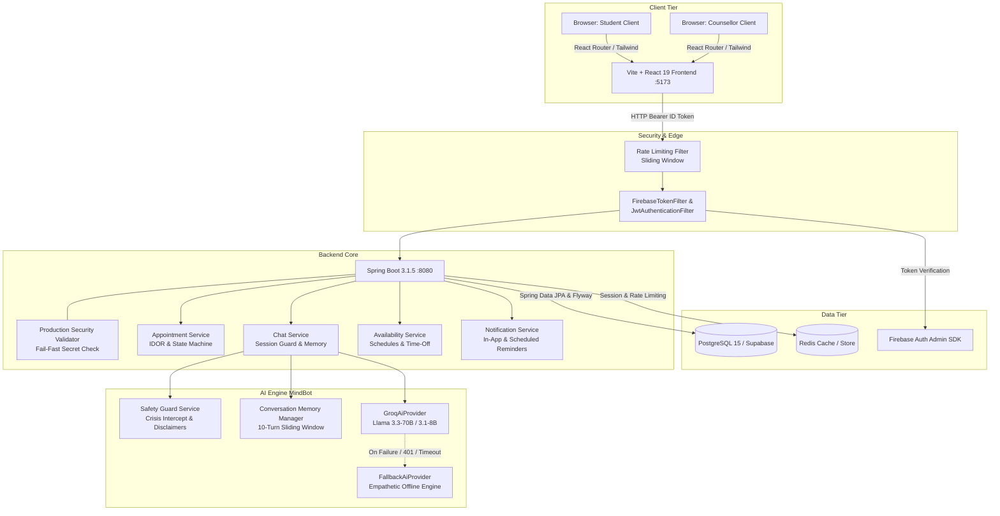

# 💚 Mindful Wellness Platform

Welcome to **Mindful**, a secure, full-stack student mental health and wellness platform designed to facilitate confidential support, mood tracking, AI-assisted guidance, and clinical session management between students and licensed counsellors.

This repository contains both the **Spring Boot backend** and the **Vite + React frontend** applications.

---

## 🌐 Live Deployments

* **Frontend (Vercel)**: [https://mindful-umber.vercel.app](https://mindful-umber.vercel.app) *(Alternative: [https://mindful-teal.vercel.app](https://mindful-teal.vercel.app))*
* **Backend API (Render)**: [https://mindful-backend-ysue.onrender.com](https://mindful-backend-ysue.onrender.com)
* **API Documentation / Health**: `https://mindful-backend-ysue.onrender.com/api/health`

---

## 🚀 Technical Architecture

The platform follows a decoupled client-server architecture with hardened security boundaries, resilient AI fallback, and real-time state synchronization:


```mermaid
graph TD
    subgraph Client Tier
        Student[Browser: Student Client]
        Counsellor[Browser: Counsellor Client]
        FE[Vite + React 19 Frontend :5173]
        Student -->|React Router / Tailwind| FE
        Counsellor -->|React Router / Tailwind| FE
    end

    subgraph Security & Edge
        RL[Rate Limiting Filter<br/>Sliding Window]
        AUTH[FirebaseTokenFilter &<br/>JwtAuthenticationFilter]
        FE -->|HTTP Bearer ID Token| RL
        RL --> AUTH
    end

    subgraph Backend Core
        BE[Spring Boot 3.1.5 :8080]
        AUTH --> BE
        SEC_VAL[Production Security Validator<br/>Fail-Fast Secret Check]
        BE --- SEC_VAL
        APPT[Appointment Service<br/>IDOR & State Machine]
        CHAT[Chat Service<br/>Session Guard & Memory]
        AVAIL[Availability Service<br/>Schedules & Time-Off]
        NOTIF[Notification Service<br/>In-App & Scheduled Reminders]
        BE --> APPT
        BE --> CHAT
        BE --> AVAIL
        BE --> NOTIF
    end

    subgraph AI Engine MindBot
        SG[Safety Guard Service<br/>Crisis Intercept & Disclaimers]
        MEM[Conversation Memory Manager<br/>10-Turn Sliding Window]
        GROQ[GroqAiProvider<br/>Llama 3.3-70B / 3.1-8B]
        FALLBACK[FallbackAiProvider<br/>Empathetic Offline Engine]
        CHAT --> SG
        CHAT --> MEM
        CHAT --> GROQ
        GROQ -.->|On Failure / 401 / Timeout| FALLBACK
    end

    subgraph Data Tier
        DB[(PostgreSQL 15 / Supabase)]
        RD[(Redis Cache / Store)]
        FB[Firebase Auth Admin SDK]
        BE -->|Spring Data JPA & Flyway| DB
        BE -->|Session & Rate Limiting| RD
        AUTH -->|Token Verification| FB
    end
```

### 🛠️ Technology Stack
* **Frontend**: React (v19), TypeScript, Vite, TailwindCSS (v4), Lucide Icons, React Router DOM (v7).
* **Backend**: Java 17, Spring Boot 3.1.5, Spring Security, Flyway (DB migrations), Hibernate/JPA.
* **Security & Auth**: Firebase Admin SDK (Identity Provider), JJWT (HS256/HS512), DB-backed role verification, sliding-window rate limiting.
* **AI & NLP**: Groq Cloud API (`llama-3.3-70b-versatile` / `llama-3.1-8b-instant`), rule-based empathetic fallback, regex crisis safety guard.
* **Data & Persistence**: PostgreSQL 15 (Docker / Supabase / Neon), Redis 7 (caching and rate limits), Flyway migrations.

---

## 🛡️ Security & Hardening Controls

The system implements end-to-end security controls following defense-in-depth principles:

1. **Zero-Trust Role Enforcement**:
   - Client-supplied roles (such as `X-User-Role` headers or unverified payload fields) are explicitly bypassed.
   - User identity and permissions are resolved exclusively from the database via `AuthUtil.getCurrentUserRole()`, eliminating privilege escalation vulnerabilities.
2. **Fail-Fast Production Validation**:
   - `ProductionSecurityValidator` executes at application boot. If running in a production profile with placeholder passwords, default secrets, or JWT secrets shorter than 256 bits (32 characters), the application fails immediately to prevent insecure deployments.
3. **Sliding-Window Rate Limiting**:
   - `RateLimitingFilter` and `RateLimiterService` protect sensitive endpoints (`/api/auth/*`, `/api/chat/*`, and `/api/ai/*`) from abuse, brute-force attacks, and DoS.
4. **IDOR Elimination**:
   - **Chat Sessions**: Students can only access, view, or append to their own chat sessions. Unauthorized access attempts return HTTP `403 Forbidden`.
   - **Appointments**: Rescheduling, cancellations, confirmations, and completions require caller ownership checks (`AppointmentService.validateAccess`). Students cannot cancel another user's session, and counsellors can only manage appointments assigned to them.
   - **Availability**: Counsellor weekly schedules and time-off records are strictly protected; only the authenticated counsellor or a platform `ADMIN` can modify them.
5. **Secrets Externalization**:
   - Zero hardcoded credentials in source control. All database, Firebase, Groq, and JWT secrets are sourced exclusively from environment variables or secure credential files.

---

## 🤖 MindBot AI & Safety Architecture

MindBot is a specialized student wellness AI companion designed for empathy, safety, and non-clinical emotional support:

1. **Modular Provider Pattern (`AiProvider`)**:
   - `GroqAiProvider`: Primary LLM engine utilizing high-speed Groq inference with structured prompt engineering.
   - `FallbackAiProvider`: An offline, rule-based empathetic engine that automatically handles network outages, API timeouts, or rate limits without interrupting student support.
2. **Multi-Stage Safety & Crisis Intercept (`SafetyGuardService`)**:
   - Evaluates incoming student messages against clinical crisis patterns (suicide, self-harm, severe distress).
   - When a crisis is detected, the AI generation is bypassed immediately, returning an empathetic message and verified 24/7 Indian emergency helplines:
     - 📞 **Tele-MANAS**: `14416` (National Tele-Mental Health Programme of India)
     - 📞 **KIRAN Helpline**: `1800-599-0019` (Ministry of Social Justice and Empowerment)
     - 📞 **Vandrevala Foundation**: `+91 9999 666 555`
   - Automatically injects medical disclaimers to prevent diagnostic or medical claims.
3. **Context Memory Sliding Window (`ConversationMemoryManager`)**:
   - Restricts conversational history to the last 10 turns (5 exchanges).
   - Keeps token consumption predictable while retaining emotional context and user flow.
4. **Enhanced Chat Experience**:
   - Real-time sentiment score analysis and mood tag badges.
   - Emergency crisis banner in the chat UI with one-click direct dialing.
   - Structured wellness assessments with downloadable summary reports.

---

## 🌟 Key Application Features

### 👤 Student Section
* 📊 **Wellness Dashboard**: View daily mood logs, upcoming appointments, and personal wellness progress.
* 📝 **Mood Journaling**: Track emotions, energy levels, sleep quality, and triggers. Maps 1-10 UI scores to 1-5 database entries.
* 👥 **Session Booking**: Select preferred counsellors, dates, time slots, and formats (Video, Phone, In-person) with automatic double-booking prevention.
* 💬 **MindBot Chatbot**: Empathetic conversational companion with safety guardrails and comprehensive wellness assessments.
* 👥 **Community Forum**: Safe, category-filtered space to share thoughts, create posts (optionally anonymous), like, and comment.
* 🎮 **Wellness Tracker**: Personal goal-setting tool with gamified level-ups, points, and unlockable badges saved to browser storage.
* 🆘 **Crisis Support**: Dedicated helpline directory and emergency guidance.

### 🩺 Counsellor Section
* 📊 **Counsellor Dashboard**: Overview of assigned students, average rating, session metrics, and schedule.
* 📅 **Appointment Manager**: Weekly calendar view to accept, reschedule, or cancel student sessions, and mark sessions as complete with clinical notes.
* ⚙️ **Availability Settings**: Set standard weekly working hours and calendar leave exceptions dynamically.
* 🗂️ **My Students Directory**: Historical lists of unique student cases with total sessions, last visit date, and average mood ratings.
* 👤 **Professional Profile**: Manage public credentials, including license number, specialisations, bio, qualifications, and session parameters.

---

## 📂 Project Structure

```
Mindful/
├── backend/                        # Spring Boot 3.1.5 Java Application
│   ├── src/main/java/com/mindful/wellness/
│   │   ├── ai/                     # MindBot Provider Engine & Safety
│   │   │   ├── provider/           # AiProvider, GroqAiProvider, FallbackAiProvider
│   │   │   ├── memory/             # ConversationMemoryManager (10-turn window)
│   │   │   └── safety/             # SafetyGuardService (Crisis Intercept & Disclaimers)
│   │   ├── config/                 # Configurations (Firebase, CORS, Beans, Validator)
│   │   ├── controller/             # REST Controllers (Auth, Appointment, Chat, etc.)
│   │   ├── dto/                    # Data Transfer Objects
│   │   ├── entity/                 # JPA Database Entities
│   │   ├── repository/             # Spring Data Repositories
│   │   ├── security/               # Rate Limiting & Auth Filters
│   │   │   ├── jwt/                # FirebaseTokenFilter & JwtAuthenticationFilter
│   │   │   └── rate/               # RateLimiterService & RateLimitingFilter
│   │   └── service/                # Business Logic & Scheduled Tasks
│   ├── src/main/resources/
│   │   ├── db/migration/           # Flyway PostgreSQL Migrations (V1 to V3)
│   │   └── application.properties  # App Properties & Secrets mapping
│   ├── .env.example                # Backend Environment Variables Template
│   └── pom.xml                     # Maven Build Configuration
│
├── frontend/                       # Vite + React 19 Single Page Application
│   ├── src/
│   │   ├── components/             # Reusable UI & Layout Components
│   │   ├── context/                # AuthContext, ThemeContext
│   │   ├── pages/                  # Student & Auth Pages
│   │   │   └── counsellor/         # Counsellor Management Pages
│   │   ├── services/               # REST API Clients (apiClient, chatService, etc.)
│   │   ├── types/                  # TypeScript Interfaces
│   │   └── index.css               # Global Tailwind CSS Styles
│   ├── .env.example                # Frontend Environment Variables Template
│   └── package.json                # Dependencies & Build Scripts
│
└── README.md                       # Comprehensive Platform Documentation
```

---

## ⚡ Setup & Launch Guide

### Prerequisites
* Java 17+ & Maven 3.8+
* Node.js 18+ & npm
* Docker & Docker Compose

### Step 1: Start Database & Cache
Spin up PostgreSQL and Redis in the background:
```bash
cd backend
docker-compose up -d
```
*PostgreSQL runs on port `5432` (`mindful_db`), and Redis runs on port `6379`.*

### Step 2: Configure & Start Backend
1. Copy the environment template:
   ```bash
   cd backend
   cp .env.example .env.local
   ```
2. Fill in the required variables in `.env.local` or export them:
   ```bash
   DATABASE_URL=jdbc:postgresql://localhost:5432/mindful_db
   DATABASE_USERNAME=mindful
   DATABASE_PASSWORD=mindful123
   JWT_SECRET=your_32_character_or_longer_secure_jwt_secret_key!
   GROQ_API_KEY=gsk_your_groq_api_key
   ```
3. Run the Spring Boot application:
   ```bash
   mvn spring-boot:run
   ```
   *The backend starts on `http://localhost:8080` with API prefix `/api`.*

### Step 3: Configure & Start Frontend
1. Copy the frontend environment template:
   ```bash
   cd frontend
   cp .env.example .env.local
   ```
2. Ensure API base URL and Firebase keys are set:
   ```env
   VITE_API_BASE_URL=http://localhost:8080/api
   VITE_FIREBASE_API_KEY=your_firebase_api_key
   VITE_FIREBASE_AUTH_DOMAIN=your_project.firebaseapp.com
   VITE_FIREBASE_PROJECT_ID=your_project_id
   ```
3. Install dependencies and start Vite dev server:
   ```bash
   npm install
   npm run dev
   ```
   *Frontend is live on `http://localhost:5173`.*

---

## 📊 Core API Endpoints

| Category | Method | Endpoint | Description | Auth Required |
|----------|--------|----------|-------------|---------------|
| **Auth** | `POST` | `/api/auth/register` | Register a new user | No |
| | `POST` | `/api/auth/login` | Authenticate with credentials | No |
| | `GET` | `/api/auth/me` | Fetch authenticated user profile & role | Yes |
| **MindBot AI** | `POST` | `/api/chat/sessions` | Create a new AI chat session | Yes (Student) |
| | `GET` | `/api/chat/sessions` | List student's own chat sessions | Yes (Student) |
| | `POST` | `/api/chat/sessions/{id}/messages` | Send message to MindBot (AI response) | Yes (Student) |
| | `POST` | `/api/ai/sentiment` | Analyze sentiment of a text block | Yes |
| **Appointments** | `GET` | `/api/appointments` | Get appointments for caller | Yes |
| | `POST` | `/api/appointments` | Book an appointment slot | Yes (Student) |
| | `PUT` | `/api/appointments/{id}` | Reschedule an appointment | Yes (Owner) |
| | `POST` | `/api/appointments/{id}/cancel` | Cancel an appointment with reason | Yes (Owner) |
| | `POST` | `/api/appointments/{id}/confirm` | Counsellor accepts booking | Yes (Counsellor) |
| | `POST/PUT`| `/api/appointments/{id}/complete` | Mark appointment complete with notes | Yes (Counsellor) |
| **Availability** | `GET` | `/api/counsellors/{id}/availability` | View counsellor working hours | Yes |
| | `PUT` | `/api/counsellors/{id}/availability` | Update working hours | Yes (Counsellor/Admin) |
| | `POST` | `/api/counsellors/{id}/time-off` | Schedule vacation / time off | Yes (Counsellor/Admin) |
| **Mood** | `POST` | `/api/mood/entries` | Submit daily mood entry | Yes (Student) |
| | `GET` | `/api/mood/history` | Paginated mood history | Yes (Student) |
| **Notifications**| `GET` | `/api/notifications/unread` | Fetch unread in-app notifications | Yes |
| | `PUT` | `/api/notifications/{id}/read` | Mark notification as read | Yes |

---

## 🧪 Testing & Verification

### Backend Verification
Run the complete unit and integration test suite:
```bash
cd backend
mvn test
```
*Expected: 8/8 tests pass with 0 failures and 0 errors.*

### Frontend Verification
Verify TypeScript type-checking and build production bundle:
```bash
cd frontend
npm run build
```
*Expected: 1,800+ modules transform cleanly with zero compilation errors.*

---

## 🚀 Production Deployment Runbook

### Environment Variables Checklist

#### Backend (Render / Railway / Cloud VM)
- `DATABASE_URL`: Cloud PostgreSQL JDBC URL (`jdbc:postgresql://host:port/database?sslmode=require`)
- `DATABASE_USERNAME`: Database username
- `DATABASE_PASSWORD`: Strong database password
- `JWT_SECRET`: Minimum 32-character high-entropy secret string
- `GROQ_API_KEY`: Active Groq Cloud API key
- `FIREBASE_CREDENTIALS_JSON`: Minified single-line Firebase service account JSON
- `CORS_ALLOWED_ORIGINS`: Comma-separated list of production frontend domains (e.g., `https://mindful-umber.vercel.app,https://mindful-teal.vercel.app`)

#### Frontend (Vercel / Netlify)
- `VITE_API_BASE_URL`: Production backend API base URL (`https://mindful-backend-ysue.onrender.com/api`)
- `VITE_FIREBASE_API_KEY`: Production Firebase Web API key
- `VITE_FIREBASE_AUTH_DOMAIN`: Production Firebase Auth domain
- `VITE_FIREBASE_PROJECT_ID`: Firebase project ID
- `VITE_FIREBASE_STORAGE_BUCKET`: Storage bucket URL
- `VITE_FIREBASE_MESSAGING_SENDER_ID`: Cloud messaging sender ID
- `VITE_FIREBASE_APP_ID`: Firebase application ID

### Security Hygiene & Key Rotation
1. **Database Credentials**: Periodically rotate PostgreSQL database passwords via Supabase/Neon dashboards.
2. **Groq API Keys**: Revoke and regenerate keys if exposed or during scheduled quarterly rotations.
3. **JWT Secret**: Update `JWT_SECRET` when resetting user sessions; existing sessions will naturally expire and refresh safely.
4. **Firebase Service Account**: Restrict Firebase service accounts to `Firebase Authentication Admin` role permissions.
